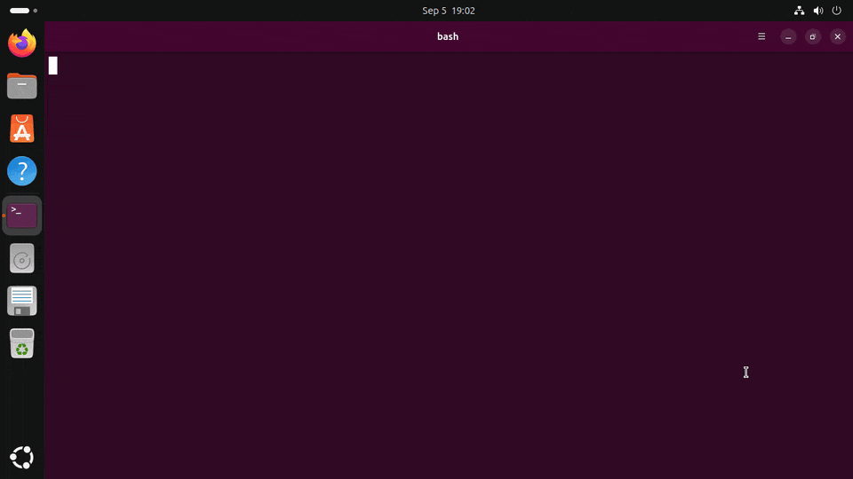
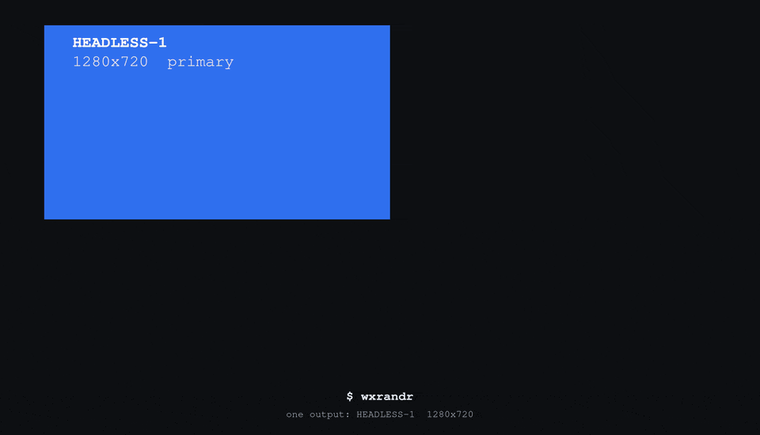

# fuckwayland

The X11 power tools, `xdotool`, `wmctrl`, `xprop` and `xrandr`, reborn as no-bullshit
drop-in clones that work on Wayland. Same commands, same flags, same output bytes,
same scripts, bugs faithfully included. Symlink them over the originals and your
muscle memory never finds out the compositor changed underneath it.

<p align="center">

</p>

In the box:

- **wdotool**, xdotool, all 48 commands, byte-parity
- **wwmctl**, wmctrl, for native Wayland *and* legacy X apps in one list
- **wxprop**, xprop, real X properties for XWayland windows and synthesized ones for native windows
- **wxrandr**, xrandr, with first-class multimonitor: reshape crazy layouts in one atomic call
- **warandr**, arandr, the drag-your-monitors GUI, on Wayland (via wxrandr) and X11 (via xrandr)
- **wmirror**, the one that clones nothing: mirror a *region*, or an odd-shaped output, on wlroots

## Motivation

- https://www.semicomplete.com/blog/xdotool-and-exploring-wayland-fragmentation/
- https://daniele.tech/2025/04/how-to-center-the-mouse-between-monitors-in-wayland/
- https://thelastguardian.me/posts/2026-04-26-screen-control-on-wayland/
- https://discuss.kde.org/t/questions-about-ui-automation-on-kwin-wayland/1778
- https://discuss.kde.org/t/move-mouse-to-screen/28971

## Install

On a default Ubuntu 24.04 or 26.04 desktop, one file and one command. The built
package is in the clone, at
[`release/fuckwayland_0.3.0_all.deb`](release/fuckwayland_0.3.0_all.deb), and on the
[releases page](https://github.com/antoniobianchi333/fuckwayland/releases). From the
top of a clone:

```sh
sudo apt install ./release/fuckwayland_0.3.0_all.deb
```

`sh scripts/build-deb.sh` rebuilds that same file in place from the source beside it.

That is the six tools in `/usr/bin`, the GNOME Shell bridge extension where
`gnome-shell` looks for it, the udev rule that opens `/dev/uinput` to whoever is at
the seat, and the `warandr` menu entry. **One** `Architecture: all` package for
**both** releases, because every module here is pure standard library and your own
`python3` byte compiles it at install time. The real `xdotool`, `wmctrl`, `xprop` and
`xrandr` stay exactly as they were, so a script that calls both keeps working, and
`sudo apt remove fuckwayland` takes every piece away again.

**On GNOME, log out and back in once.** That is the whole of the manual procedure.
`gnome-shell` reads extension directories only when a session starts, so until you do
that the window commands say the bridge is not running. The package enables the
extension for you inside that first session. Everything else works the moment apt
finishes: the display commands, the GUI, typing and clicking.

Then [check it worked](#check-it-worked). If the package is not what you want, the
other routes are [a clone with pip](#from-a-clone-with-pip), which is the normal one
for development, and [pipx, the user site, one venv for the whole machine, the
single-file builds and nix](#other-ways-to-install). What the package puts where, and
why the extension and the rule are handled the way they are, is
[debian/README.Debian](debian/README.Debian) and
[docs/Technical.md § 11](docs/Technical.md#11-installing-what-each-route-costs).


*The whole of it on a default Ubuntu 26.04 desktop, in real time: one `apt` command
(the package copied to the home directory first, so the path typed there is shorter
than the one above), the package explaining the one manual step, and the six tools
answering `--version`.*

### What your desktop needs

Whichever route you took, your desktop wants a piece of its own, and on three of the
four that piece is nothing.

#### GNOME

Stock GNOME Wayland sessions, Ubuntu 24.04 (GNOME 46) and 26.04 (GNOME 50) as
installed, need one extra thing: GNOME has no window management protocol, so the
window side goes through a small GNOME Shell extension that exports Mutter over the
session bus. The [.deb](#install) brings it. From a clone, run the installer
yourself, because pip does not install it:

```sh
sh gnome/install-bridge.sh          # copies the extension, enables it
sh gnome/install-bridge.sh --check  # is it loaded? is org.fuckwayland.Bridge owned?
```

Expect one session restart. The first install exits 1 asking you to log out and back
in, because gnome-shell only scans extension directories at login, and until you do
the window commands say the bridge is not running. `wxrandr` and `warandr` never need
it (monitors go through Mutter's own DisplayConfig), so those two work meanwhile.
Everything `wdotool`, `wwmctl` and `wxprop` do on GNOME goes through it. What it
exports, where it puts itself and which hotkey chords Mutter will not hand to a
script are in [gnome/README.md](gnome/README.md), and what installing it grants, to
whom, is [Threat model](#threat-model).

#### KDE Plasma

Stock Plasma Wayland sessions, Plasma 5.27 (Ubuntu 24.04) and Plasma 6.6 (26.04),
work with **nothing to install**. `org.kde.kwin.Scripting.loadScript()` is plain
`Q_SCRIPTABLE` with no polkit action and no bus policy on both, so `wdotool` pushes
one small JavaScript file into KWin per command and unloads it again, and `wwmctl`,
`wxprop` and `wxrandr` come along with it. That is also a security note in the GNOME
sense: any client on your session bus can already do this, with or without these
tools.

What KWin does differently from X, per command, is the table in
[docs/WDOTOOL.md](docs/WDOTOOL.md#what-differs-from-x-on-kde-plasma): no per-window
raise on 5.27, no per-window lower on either, shading gone in Plasma 6, maximize read
off the geometry on 5.27, and window ids minted from KWin uuids because the scripting
API has no numeric id at all. **Plasma on X11** is none of that: it is a plain
[X11](#x11-sessions) session and is handled as one, on both generations.

#### sway and other wlroots compositors

Stock sway (1.11 on Ubuntu 26.04) works with **nothing to install** for the four
command-line tools: they speak sway's own IPC, and `wxrandr --print-backend` answers
`sway`. It is also the one family where **input needs no privilege at all**, see
[Input access](#input-access). The GUI is the exception, and the one place a sway
install differs from a GNOME, KDE or Xfce one: a minimal sway install has
`python3-gi` but **not** the GTK 3 typelib, so `warandr` exits 1 naming the package,
and `sudo apt install python3-gi gir1.2-gtk-3.0` is the whole fix. Such an image has
no `acl` package either, which changes one line of `install-bridge.sh --udev --check`
and nothing else.

#### X11 sessions

**What to install:** the real tools, if they are not already there,
`sudo apt install xdotool wmctrl`. (`xprop` and `xrandr` come with every X11 desktop,
in `x11-utils` and `x11-xserver-utils`.) Nothing else: no extension, no udev rule, no
`/dev/uinput`. Without them you get exit **127** and a line naming the package to
install.

The tools are meant to be installed **over** the originals, so on a plain X11 session
(Xfce, i3, GNOME-on-Xorg, KDE-on-Xorg) they detect the session and hand over to the
real `xdotool`, `wmctrl`, `xprop` or `xrandr` with `execve` and argv untouched: same
exit status, same signals, same stdio, no extra process. One script then runs on both
session types. Run under `sudo`, over `ssh root@box` or from cron and we find the
session's `DISPLAY` and `XAUTHORITY` and hand those over too, so `sudo xdotool key a`
works *through* us where `sudo /usr/bin/xdotool key a` says `Can't open display`.

```console
$ FUCKWAYLAND_PASSTHROUGH=never xdotool key a   # our own code, whatever the session
$ FUCKWAYLAND_PASSTHROUGH=always ...            # hand over, whatever the session
$ WDOTOOL_REAL_XDOTOOL=/opt/bin/xdotool ...     # where the original is
```

What stays ours on X11 (`wdotool keys`, the leading `--layout` and `--vkbd` options),
the per tool `*_PASSTHROUGH` and `*_REAL_*` variables, why detection is Wayland first
and what a Plasma X11 session in particular does are all in
[docs/Technical.md § 2](docs/Technical.md#2-session-discovery-and-the-x11-handover).

### Input access

Injecting input goes through the kernel's `/dev/uinput`, which is `root:root 0600` on
a stock Ubuntu, so `wdotool`'s **input** commands (`key`, `type`, `click`,
`mousemove`, `mousedown` and `mouseup`, `behave`, and any chain containing one) need
either root or the udev rule this repo ships. On **sway and the wlroots family** they
need neither, because the compositor offers both halves as unprivileged Wayland
protocols and wdotool uses them exactly where the kernel device is closed. Everything
else needs nothing at all: the window commands, all of `wwmctl`, `wxprop`, `wxrandr`
and `warandr` reach the compositor over your own session bus and run as you.

**Run as root** and no rule is needed: `sudo wdotool key a` works as installed,
because the session's sockets are found by scanning `/run/user/*`, which is also what
makes every tool here work over `ssh root@box` and from cron. **Or install the rule**,
which the [.deb](#install) does for you and a clone does in one command:

```sh
sudo sh gnome/install-bridge.sh --udev            # install it
sudo sh gnome/install-bridge.sh --udev --check    # what is the node now?
sudo sh gnome/install-bridge.sh --udev --uninstall # put it back
```

It tags the node `uaccess`, so systemd-logind gives the user of the *active seat* an
ACL on it: applied immediately (no relogin needed) and again at every login. The node
itself stays `root:root 0600`, no `input` group is involved, and `--uninstall`
restores exactly that. Despite living under `gnome/`, none of this is GNOME's
business: the same command installs the same rule on a Plasma, sway or Xfce session,
and `--udev` never touches the bridge extension. Read the [Threat
model](#threat-model) first, because anyone who can open `/dev/uinput` can type as
you, and know one gotcha while you experiment: `wdotool` keeps the virtual devices
alive in a small `__daemon` process, and one started while access existed keeps
injecting after the rule is removed. Log out, or stop it, to see the change.

### From a clone, with pip

```sh
sudo apt install git python3-venv
git clone https://github.com/antoniobianchi333/fuckwayland.git
cd fuckwayland
python3 -m venv --system-site-packages ~/.venvs/fuckwayland
~/.venvs/fuckwayland/bin/pip install -e .
```

That is the whole install: `wdotool`, `wwmctl`, `wxprop`, `wxrandr`, `warandr` and
`wmirror` in `~/.venvs/fuckwayland/bin`. Put them on `PATH`:

```sh
for t in wdotool wwmctl wxprop wxrandr warandr wmirror; do
    sudo ln -sfn ~/.venvs/fuckwayland/bin/$t /usr/local/bin/$t
done
```

A **venv** because Ubuntu marks the system Python externally managed,
**`python3-venv`** rather than `python3-pip` because a stock desktop has neither and
a venv brings its own pip, **`--system-site-packages`** because `warandr` imports the
system GTK 3 bindings, and **`-e`** with the clone kept, because pip installs the six
commands and nothing else: not `gnome/install-bridge.sh`, not the udev rule, not
`warandr.desktop`. The measurements behind all four, and the one line that differs on
24.04, are in
[docs/Technical.md § 11](docs/Technical.md#11-installing-what-each-route-costs).

Optional, for the GUI: an application menu entry for `warandr`, whose `Exec=` is the
bare name and so wants the symlink above.

```sh
mkdir -p ~/.local/share/applications
cp warandr.desktop ~/.local/share/applications/
```

To undo all of it:

```sh
sudo rm -f /usr/local/bin/wdotool /usr/local/bin/wwmctl /usr/local/bin/wxprop \
           /usr/local/bin/wxrandr /usr/local/bin/warandr /usr/local/bin/wmirror
rm -rf ~/.venvs/fuckwayland ~/.local/share/applications/warandr.desktop
```

### Other ways to install

All of these were run on a stock desktop and all of them work. Pick by what you want,
not by what is possible.

* **pipx**: `sudo apt install pipx`, then `pipx install --system-site-packages -e .`
  and `pipx ensurepath` once. Prefer it if pipx is already how you keep your tools.
  `--system-site-packages` is not optional here either, or `warandr` fails exactly as
  [above](#from-a-clone-with-pip). Lands in `~/.local/bin`. Undo with
  `pipx uninstall fuckwayland`.
* **The user site, overriding the rule**: `sudo apt install python3-pip`, then
  `pip install --user --break-system-packages -e .`. Prefer it when you want no venv
  at all and you accept the risk that flag names. Also `~/.local/bin`, which a
  *login* shell adds from `~/.profile`, but only if the directory existed at login,
  so log out and back in once. Undo with
  `pip uninstall --break-system-packages fuckwayland`.
* **One venv for the whole machine**: `sudo python3 -m venv --system-site-packages
  /opt/fuckwayland`, then `sudo /opt/fuckwayland/bin/pip install /path/to/the/clone`,
  and symlink out of `/opt/fuckwayland/bin`. Prefer it when other accounts (or `sudo`
  as another user) must run the tools: Ubuntu home directories are `0750`, so a venv
  under your `$HOME` is unreadable to them. Note the missing `-e`.
* **Without installing anything**: `sh scripts/build-pyz.sh` builds `dist/wdotool`,
  `dist/wwmctl`, `dist/wxprop`, `dist/wxrandr`, `dist/warandr` and `dist/wmirror`,
  six self-contained executables needing nothing but the `python3` that is already on
  the machine. No pip, no venv, no apt. Prefer it on a machine you do not administer,
  or when you want one file to copy to another box. What you give up is
  `pip uninstall` and any notion of an upgrade: you rebuild and copy again.
  [docs/Technical.md § The single-file builds](docs/Technical.md#the-single-file-builds)
  has the table of what is in each.
* **Nix**: `nix build` gives you `result/bin/` with all six tools, plus `xdotool`,
  `wmctrl`, `xprop`, `xrandr` and `arandr` symlinks next to them (`wmirror` gets
  none, because there is no X11 original to shadow). The flake wraps the GTK typelibs
  into `warandr`, so the GUI works without a system PyGObject.

Two dependencies live outside all of this, both optional: `warandr`'s GTK 3 bindings
(`sudo apt install python3-gi gir1.2-gtk-3.0`, already present on every GNOME, KDE
and Xfce desktop) and `wmirror`'s helper (`sudo apt install wl-mirror`, Ubuntu
universe, and only wlroots sessions can use it).

### Installing over the originals

These are drop-in clones, so the last step is usually to put them where your scripts
already look. `/usr/local/bin` comes before `/usr/bin` on Ubuntu's default `PATH`, so
symlinking there wins without touching a single file the package manager owns, and
the originals stay exactly where they are, which is what makes the [X11
handover](#x11-sessions) work at all.

```sh
sudo ln -sfn ~/.venvs/fuckwayland/bin/wdotool /usr/local/bin/xdotool
sudo ln -sfn ~/.venvs/fuckwayland/bin/wwmctl  /usr/local/bin/wmctrl
sudo ln -sfn ~/.venvs/fuckwayland/bin/wxprop  /usr/local/bin/xprop
sudo ln -sfn ~/.venvs/fuckwayland/bin/wxrandr /usr/local/bin/xrandr
```

From pipx or a `--user` install the source is `~/.local/bin/wdotool` instead. From a
single-file build, copy rather than link:
`sudo install -m 755 dist/wdotool /usr/local/bin/xdotool`. A clone that finds itself
under an original's name recognises itself and skips to the real binary, so none of
these loop. Undo is `sudo rm` of the four names, because nothing else was touched:

```sh
sudo rm -f /usr/local/bin/xdotool /usr/local/bin/wmctrl \
           /usr/local/bin/xprop /usr/local/bin/xrandr
```

One caution. A venv under `$HOME` is only readable by you and root, so symlinks into
`/usr/local/bin` that point into it break for *other* users, with a message that does
not say why (both messages verbatim, and the `/opt` venv that is the machine wide
answer, are in
[docs/Technical.md § 11](docs/Technical.md#11-installing-what-each-route-costs)).

### Check it worked

They all answer everywhere, whatever install path you took (from a single-file build,
prefix them with `dist/`). Note that `wxprop` takes xprop's single-dash `-version`:

```console
$ wdotool --version
xdotool version 4.20260303.1
$ wwmctl --version
1.07
$ wxprop -version
xprop 1.2.8
$ wxrandr --version
xrandr program version       1.5.4
Server reports RandR version 1.6
$ warandr --version
warandr 0.3.0
$ wmirror --version
wmirror 0.3.0
```

On a **Wayland** session (GNOME, KDE, sway) the version strings are ours, and the
next three commands are the real check: which backend was picked, whether the
compositor answers, and whether input lands.

```console
$ wxrandr --print-backend --verbose
mutter
session: wayland
chosen by: detection
compositor: Mutter
protocol: org.gnome.Mutter.DisplayConfig (D-Bus)
available: yes
$ wwmctl -l
0x8d58a7dd  0 box Screen Layout Editor
$ wdotool key a          # types an 'a' into the focused window
```

The backend token is `mutter` on GNOME, `kwin` on Plasma and `sway` on wlroots. The
second line of `wxrandr --version` is whatever RandR version your own session
reports. `wwmctl -l` on GNOME is the one that needs the [bridge
extension](#gnome). If it says so instead of listing windows, that is the step still
missing, and `wxrandr` above will have worked anyway.

On an **X11** session that block is not what you get, and that is the handover
working: the four command-line tools *are* the originals there, so they print the
versions installed on your machine rather than ours (`wwmctl --version` says `1.07`
either way: that is the wmctrl release we clone). `warandr` never hands over, and
`warandr --print-backend` says `x11`. If instead you get exit 127 and a line about no
real xdotool on `PATH`, install them: `sudo apt install xdotool wmctrl`.

If something did not work, the first thing to try:

| what you saw | what to do |
|---|---|
| `wdotool: command not found` | `command -v wdotool`, then the symlinks, or `~/.local/bin` not on `PATH` yet (log out and back in) |
| `gnome backend: the fuckwayland bridge extension is not running in GNOME Shell` | `sh gnome/install-bridge.sh`, then log out and back in. `sh gnome/install-bridge.sh --check` must say `loaded in shell: yes` and `org.fuckwayland.Bridge owned: yes` |
| `cannot create uinput devices: [Errno 13] Permission denied` | `sudo wdotool …`, or install the [udev rule](#input-access). `sudo sh gnome/install-bridge.sh --udev --check` should end `uinput usable by <your user>: yes (logind ACL)` |
| `warandr: GTK 3 for Python is not available` | `sudo apt install python3-gi gir1.2-gtk-3.0`, and the venv must have been made `--system-site-packages` |
| `xdotool: … no real xdotool was found on PATH`, exit 127 | you are on X11: `sudo apt install xdotool wmctrl` |
| the tool does something you did not expect on X11 | it *is* the original there. `FUCKWAYLAND_PASSTHROUGH=never` runs our own code instead |
| `gnome backend: the fuckwayland bridge is unavailable while the screen is locked` | unlock the session. GNOME Shell shuts its extensions down behind the lock screen, so every window command stops until you unlock, and a **default** Ubuntu desktop locks itself after 5 minutes idle. `wxrandr`, `warandr` and `wdotool`'s input commands are unaffected: they do not go through the extension |

## The tools

Each has a contract of its own, and that is where the measured detail lives. What
follows is what each one is for.

### wdotool

xdotool, but it works on Wayland. Drop-in: same commands, same flags, same output
bytes, same chaining, same scripts. Installed
[over the original](#installing-over-the-originals), your scripts do not know the
difference.

<p align="center">

</p>

*wdotool and wwmctl on a default Ubuntu 26.04 GNOME desktop: a window placed and
sized where it was told, text typed into it, the window list with geometry,
fullscreen on and off, then the pointer moved and clicked.*

```console
# wdotool search --class foot windowactivate --sync type 'echo hello from wayland'
# wdotool key Return
# wdotool mousemove 640 360 click 1 getmouselocation
x:640 y:360 screen:0 window:5
```

There is no X server to lie to, so wdotool goes underneath instead. **Input** is
injected as kernel level virtual devices via `/dev/uinput`, a keyboard, a relative
mouse and an absolute tablet (the same shape QEMU uses, which every compositor maps
across the whole output layout), so the compositor cannot tell it from real hardware.
On wlroots every injecting command skips that entirely through
`zwp_virtual_keyboard_v1` and `zwlr_virtual_pointer_v1` and needs no privilege at
all. The first invocation forks a small daemon that owns the devices, because
creating them costs about 600ms of hotplug and you should pay it once; it goes away
again a quarter of an hour after the last command, or at once when its socket does —
logging out takes the socket with the session. **Window
management** talks to the compositor: sway and i3 IPC, GNOME Shell through the
bundled bridge extension, KDE Plasma through KWin scripting, and the
wlr-foreign-toplevel protocol as the generic fallback. Window ids are real, stable
and decimal, like X window ids, so scripts pipe them around unchanged.

All 48 commands, byte-parity against xdotool 4.20260303.1, verbatim C bugs included.
Non-US keyboard layouts work, by reading the compositor's own keymap and looking the
character up backwards, and on a plain US layout none of that code runs at all.
`wdotool keys` is the layout machinery pointed the other way: what to press for a
character, or what you just pressed.

**Everything about it is in [docs/WDOTOOL.md](docs/WDOTOOL.md)**: the honest
approximations table, keyboard layouts and `--layout`, the two privilege-free
injection paths and `--vkbd`, `wdotool keys`, exit codes, the bounded `--sync` waits,
pointer accuracy, the input daemon and the per-compositor backend notes.

### wwmctl


`wmctrl`, same treatment, and it handles **both** native Wayland apps and legacy X
apps (XWayland) in one list. The compositor exposes XWayland windows with their real
X11 window ids, so wwmctl prints ids that `xprop` and your old scripts can actually
use, enriched straight from the XWayland server over a built-in X11 wire client.
Native windows ride along with compositor node ids:

```console
$ wwmctl -lGpx
0x00000005  0 31496  0    23   640  697  foot.foot             host yans@host: ~
0x0040000c  0 31526  642  23   636  695  xterm.XTerm           host yans@host: ~

$ wmctrl -lGpx        # the real one, on the same desktop
0x0040000c  0 31526  1284 46   636  695  xterm.XTerm           host yans@host: ~
```

Real wmctrl on Wayland can't see the foot window at all, prints doubled coordinates
(a non-reparenting-xwm quirk), its `-c` silently closes nothing, and `-a` only sets
an urgency hint. wwmctl routes every action through the compositor, so `-a` focuses,
`-c` closes and `-e` moves, for X and Wayland windows alike. Byte-parity covers the
rest: help text, list formats, error strings, exit codes. One deliberate exception:
the machine column is sized from the longest hostname, not, as wmctrl 1.07's `main.c`
does, from the last row's, which our stacking-ordered list would reflow on every
raise.

On GNOME (with the [bridge extension](#gnome)) the same list mixes XWayland windows
under their real X ids with native windows under Mutter's ids, `-d` prints GNOME's
workspace names and work areas, and every action goes through Mutter, including
`-b add,maximized_vert` as a real per-axis maximize. The X plane is reached with
Mutter's own Xwayland cookie, so it works from a custom shortcut, under `sudo` and
from `ssh root@` alike.

Contract: [docs/WWMCTL.md](docs/WWMCTL.md).

### wxprop


`xprop`, dual-plane. XWayland windows report their **real** X properties, byte for
byte identical to xprop 1.2.8. The whole formatting machine is ported, down to the
`WM_HINTS` and `WM_SIZE_HINTS` structured dumps, the dformat mini-language, 32-bit
sign-extension quirks, and yes, the `_NET_WM_ICON` ASCII-art renderer. Native Wayland
windows get a synthesized property set in the same grammar, so `xprop -id N WM_CLASS`
script parsing works on every window:

```console
$ wxprop -id 0x0040000c WM_CLASS       # an XWayland window, real X property
WM_CLASS(STRING) = "xterm", "XTerm"

$ wxprop -id 5 WM_CLASS                # a native Wayland window, synthesized
WM_CLASS(STRING) = "foot", "foot"
```

`-set`, `-remove` and `-spy` work on the X plane. `-f`, `-fs`, dformats, `-len`,
`-root`, `-name` and click-to-select all match the real tool, including which
double-dash forms it rejects. Verified byte-identical against the real xprop on a
live XWayland server. `-font` is real too: XWayland serves the core fonts, so
`wxprop -font fixed` is byte-identical to `xprop -font fixed`.

On GNOME native windows get their synthesized set from the bridge and `-spy` follows
the shell's window events. `-root` is Mutter's real X root with `_NET_CLIENT_LIST`,
`_NET_ACTIVE_WINDOW` and the desktop properties re-synthesized so they cover native
windows too. Two honest limits, both inherent: a native window has no window-type
hint to report, so a GTK dialog prints `_NET_WM_WINDOW_TYPE_NORMAL` where its
XWayland twin prints `DIALOG`, and under `-len` truncation real xprop renders
*uninitialised heap* past the end of the fetched data, which nothing can reproduce,
so we stop at the budget instead.

Contract: [docs/WXPROP.md](docs/WXPROP.md).

### wxrandr



`xrandr`, with the crazy multimonitor configs as the whole point rather than an
afterthought. A real pending-geometry resolver means relative-placement chains
resolve in **one atomic invocation**:

```console
$ wxrandr --output DP-2 --right-of DP-1 --output HDMI-A-1 --below DP-2 --rotate left
$ wxrandr --output DP-2 --scale 1.5x1.5 --output DP-1 --primary
$ wxrandr --output HDMI-A-1 --same-as DP-1        # mirror
```

Mirroring, rotation, reflection, mixed per-output scales, portrait and landscape
mixes, custom modelines (`--newmode` with real pixel-clock math), holes in a row,
negative origins and `--dryrun` are all first class. `--brightness` and `--gamma` run
over wlr gamma-control via a detached holder process, because the control dies with
its client and we simply refuse to die. Query and `--listmonitors` output is byte
styled after xrandr 1.5.4, and the layout stays consistent with the rest of the
toolbox: after any change, `wdotool getdisplaygeometry` and `wwmctl -d` track the new
world.

It works on a stock GNOME desktop with no shell extension and no root, submitting the
whole layout to `org.gnome.Mutter.DisplayConfig` as one `ApplyMonitorsConfig` call.
Mutter's own validation errors come back as one-line failures in Mutter's name,
because nothing is refused here, so a "no" is always the compositor's. Since Mutter,
unlike X, allows neither gaps nor overlaps, an output that changes size keeps its
neighbours touching it, with a warning. Changes are temporary like xrandr's and write
nothing. `--persistent` makes GNOME ask *Keep changes?*, and only a confirmed dialog
writes `monitors.xml`, and that dialog is the only safe way that file is ever
written. Why Mutter refuses monitors that share area, and what to reach for instead,
is under
[What your desktop will not let warandr do](#what-your-desktop-will-not-let-warandr-do).

Which backend it is using is never a guess: `--print-backend` prints the token
(`--verbose` adds the session, why it was chosen, the compositor and the protocol
version), `--backends` lists them all with their availability here and a reason where
there is none, and `--backend NAME` forces one for that invocation, beating
`$WXRANDR_BACKEND`, which beats detection. `--backend x11` means "hand over to the
real xrandr", even on Wayland. A Wayland backend runs our own code even on X11. An
unavailable one is one line saying what was missing, never a silent fallback.

From Plasma 6.7 KWin publishes its outputs through a registry object instead of as
`wl_registry` globals, and `wxrandr` switches discovery paths to match, measured
against `kscreen-doctor` on a real 6.7.4 session, see
[docs/WXRANDR.md § KWin backend](docs/WXRANDR.md#kwin-backend-wxrandrkwinpy).

```console
$ wxrandr --backends
  sway    unavailable  no sway or i3 IPC socket ($SWAYSOCK)
  kwin    unavailable  the compositor does not advertise kde_output_management_v2
* mutter  available    org.gnome.Mutter.DisplayConfig on the session bus
  wlr     unavailable  the compositor does not advertise zwlr_output_manager_v1
  x11     available    /usr/bin/xrandr
```

**Nothing here restores a layout on its own.** There is no daemon, no service and no
autostart entry, and what becomes of a layout after you set it is the desktop's
business, which the four desktops do not agree on. The measured table, and the recipe
for putting a layout on a hotkey, are
[docs/WXRANDR.md § Keeping a layout](docs/WXRANDR.md#keeping-a-layout).

Contract: [docs/WXRANDR.md](docs/WXRANDR.md).

### warandr

`arandr`, the little GTK window where you drag your monitors around, reborn for
Wayland. Same window, same menus, same `~/.screenlayout/*.sh` scripts: warandr loads
arandr's saved layouts and arandr loads warandr's. Under Wayland it talks to
`wxrandr` (one atomic apply per click), under X11 to plain `xrandr`, and it tells you
in the status bar exactly which command Apply is about to run:

```console
$ warandr                      # the GUI: drag, snap, right-click, Apply
$ warandr --command            # what Apply would run, no GUI
wxrandr --output DP-1 --primary --mode 1920x1080 --pos 0x0 --rotate normal --output HDMI-A-1 --mode 1280x1024 --pos 1920x0 --rotate left
$ warandr --save ~/.screenlayout/desk.sh   # an arandr-compatible layout script
```


*Two monitors on a default Ubuntu 26.04 desktop, dragged from side by side to
stacked and applied, and the layout saved as a script. The window that dives off the
bottom of the screen lands on the monitor that is now below it.*

On top of arandr's menu (Active, Primary, Resolution, Orientation) every output also
gets Refresh rate, Reflection, Mirror of, and, on Wayland only, Scale (1, 1.25, 1.5,
1.75, 2 and 3, the compositor's HiDPI factor). The layout is kept anchored at 0,0,
Apply runs off the main loop, and a failed Apply keeps your edits. The canvas is
plain widgets, so the GTK 3 bindings are the whole dependency, not even cairo.

#### What your desktop will not let warandr do

warandr sends what you drew. Where a layout is refused, the compositor refused it,
and the window says so in that compositor's own words rather than ours. The rules
differ, and **GNOME is much the strictest**, which matters because it is what a stock
Ubuntu desktop runs.

| | GNOME (Mutter) | KDE (KWin) | sway and wlroots | X11 |
|---|---|---|---|---|
| Monitors that **overlap** | refused | allowed | allowed | allowed |
| A **gap** between monitors | refused | allowed | allowed | allowed |
| **Mirroring** two monitors | only at the same mode, rotation and scale | any shapes, KWin scales the copy | same shape only, the smaller one crops | allowed |
| The layout **after a reboot** | gone unless you asked to keep it | always kept | gone | gone |

On GNOME every layout must be exactly edge adjacent. One validator on the way in
decides that, checking each monitor for an edge it shares with a neighbour by exact
integer equality, so an overlap and a gap come back with the same sentence, *Logical
monitors not adjacent*, and nothing is half applied. It is not a permission problem
and it is not something these tools could route around: GNOME's own Settings panel
submits the same call and gets the same answer. Nothing else in the compositor needs
the rule, and a GNOME session on Xorg never runs the check at all, which is why the
identical layout is taken as drawn on X11, on KDE and on wlroots. The status bar
tells you at the moment of the drop, before you press Apply.

Mirroring does work on GNOME, but only between monitors that can take an identical
mode, rotation and scale, because Mutter mirrors by making one logical monitor out of
several panels rather than by putting two monitors in the same place. Two monitors of
different resolutions are refused by name, saying which two differ and how. KWin is
the one desktop that will scale a mirrored copy onto a differently shaped panel. On
wlroots the copy crops instead, which is the gap [`wmirror`](#wmirror) fills.

There is an honest substitute, and it is not an overlap. GNOME will not place two
monitors so that they share area, and the closest thing to be had is a mirrored
region: the same pixels in two places, matching exactly, and that is the whole of it.
The copy is a copy, so it takes the clicks that land on it rather than passing them
to the window they came from, and where it is made by screen capture instead of by
the layout it lasts only as long as that capture session, which a screen lock ends.
Whole monitor mirroring is the layout doing it, above. A region of one monitor on
another is [`wmirror`](#wmirror) on wlroots, and on GNOME it needs the desktop
portal, which asks permission once a session.

**Never hand edit `~/.config/monitors.xml` to force an overlap.** Mutter reads that
file back through the same validator and throws away the **whole file** when any part
of it fails, so one bad entry silently takes every other monitor arrangement you had
saved down with it, at every boot, and the only trace is a line in the system journal.

There is one way through, and it is off, it is not in the package, and it is not in
this window. `wxrandr --unsafe-gnome-overlap` places the layout anyway, by writing
into the running `gnome-shell` through a second Shell extension installed by hand; it
does nothing unless GNOME refuses the layout, it re-checks the running Mutter before
every write and refuses on any build it has not been measured on, it saves nothing, it
prints what it is about to do and how to undo it, and if all of its checks are wrong
anyway the price is the session. It is
[docs/WXRANDR.md § --unsafe-gnome-overlap](docs/WXRANDR.md#--unsafe-gnome-overlap-the-one-route-through),
and if you are not sure you want it, you do not.

One more GNOME habit worth knowing: an Apply that switches a monitor on or off makes
the desktop move keyboard focus off the window, so click it again before the next
Ctrl+S. And a monitor plugged in while the window is open shows up after New
(Ctrl+N), as in arandr.

The measurements behind all of this, per compositor and per version, are in
[docs/WARANDR.md](docs/WARANDR.md), and why Mutter refuses at all, with every route
that has been tried, is in
[docs/Technical.md](docs/Technical.md#why-mutter-refuses-monitors-that-share-area).

Which backend it is talking to is in the window at all times. The status bar's right
hand corner says `backend: mutter (Wayland)` or `backend: xrandr (X11)`, with the
full explanation in its tooltip, and **Layout ▸ Backend** changes it: Automatic, X11
(xrandr), sway, wlroots, GNOME (mutter), KDE (kwin), with the ones this session
cannot reach greyed out and the reason given. If one cannot be reached you get the
dialog and the previous backend back, never an empty window. The same spellings work
on the command line, so a hotkey can pin one.

Contract: [docs/WARANDR.md](docs/WARANDR.md), including where the layout scripts go
and how to bind one to a key on each desktop.

### wmirror

The one tool here that clones nothing, because there is no X11 `wmirror` and no
`xrandr` syntax for what it does. On wlroots it mirrors **a region** of an output, or
a whole output onto a **differently shaped** one, by driving the existing
[`wl-mirror`](https://github.com/Ferdi265/wl-mirror) and owning its lifetime.

```console
$ wmirror DP-1 --to HDMI-A-1                      # whole output, any shape
$ wmirror DP-1 --to HDMI-A-1 --region 800x600+300+200   # just that rectangle
$ wmirror --list
HDMI-A-1 <- DP-1  region 800x600+300+200  scaling fit  wl-mirror pid 40021
$ wmirror --stop HDMI-A-1
```

**It runs only where the layout cannot do the job.** Two outputs of the same size at
the same position already mirror on wlroots, byte identical, whole frame, measured,
so that stays the answer and wmirror sends you there:

```console
$ wmirror DP-1 --to DP-2
wmirror: DP-1 and DP-2 are both 1920x1080: the layout mirrors them byte for byte, with no helper and no cost
  wxrandr --output DP-2 --same-as DP-1
  --keep-layout runs wl-mirror anyway, so DP-2 keeps its own place in the layout
```

It also refuses, by name, what the measurements showed goes wrong: two outputs that
share pixels (the helper then captures itself, and run on purpose both heads went
entirely black), a region that runs off the source, a target that is already
mirroring, and two mirrors pointing at each other. A running mirror ends itself if
the layout moves out from under it.

**What it costs**, and it says so up front: a resident process and a frame of latency
(median about 63 ms measured, at the rig's floor). A mirror asks for a frame every
frame, so an otherwise idle desktop never idles again while it lives, which was 88%
of a software-rendered core in the test VM. `wl-mirror` is invisible to output
management, so `--query` cannot show it, but `wmirror --list` verifies every pid it
prints and `--stop` and `--stop-all` end them. Nothing is left running that you
cannot find and stop, including when wmirror's own supervisor is killed.

**wlroots only.** `wmirror --check` says whether this session qualifies and what is
missing if it does not, and **(k)** in the support matrix is why GNOME and KDE cannot
have it.

Contract: [docs/WMIRROR.md](docs/WMIRROR.md).

## Desktop support

What each tool does on each desktop, measured rather than assumed, on nine golden VM
images: GNOME 46 and 50, Plasma 5.27 and 6.6 on Wayland and the same two again on
**Xorg**, Xfce 4.18 and 4.20, sway 1.11 on wlroots, twice per image, once **inside
the session** and once as **root over ssh with an empty environment**, against real
windows on a two-head layout. Three more images stand behind the table without being
counted in it: a default Ubuntu 26.04 and a default 24.04 desktop installed from the
release ISOs, on which this whole install guide was re-run verbatim, and a Plasma 6.7
cloud image, which is a probe for one protocol change rather than a support target.
`vm/README.md` keeps the rig and the verbatim messages behind these cells, and
[docs/Technical.md § 10](docs/Technical.md#10-the-vm-rig) is what the images are and
where a cloud flavor is measurably not a desktop install.

The last column is a *session type*, not a desktop: what an X11 session gets is the
real tools, whichever desktop is drawing it.

| | GNOME 46 / 50 | Plasma 5.27 / 6.6 (Wayland) | X11 sessions: Xfce 4.18 / 4.20, Plasma on Xorg **(j)** | sway 1.11 (wlroots) |
|---|---|---|---|---|
| **wdotool** | all 48 commands, and the window ones need the [bridge extension](#gnome) **(l)** | all 48, nothing to install **(a)** | hands over to the installed `xdotool` **(b)** | all 48, four differences **(c)** |
| **wwmctl** | works, the window list needs the bridge | works **(d)** | hands over to `wmctrl` | works |
| **wxprop** | works, X and native windows | works | hands over to `xprop` | works, and from a root shell `-root` is synthesized **(e)** |
| **wxrandr** | works (mutter) | works (kwin) **(f)** | hands over to `xrandr` **(g)** | works (sway) |
| **warandr** | works (mutter) | works (kwin) **(f)** | works, driving the real `xrandr` **(g)** | works (sway), and the stock image has no GTK 3 bindings **(h)** |
| **wmirror** | no, no capture protocol, the portal prompts **(k)** | no, same **(k)** | no, X11 mirrors outputs with `xrandr --same-as` | region and odd-shape mirroring, via `wl-mirror` **(k)** |
| **`wdotool` without root** | pointer *and* keyboard need the udev rule (or root) | pointer *and* keyboard need the udev rule (or root) | nothing needs it (X11) | **nothing needs it**: keyboard and pointer both **(i)** |

All of it works **as the desktop user and as root** (`sudo`, `ssh root@box`, cron),
because the session's compositor socket, session bus, `DISPLAY` and X cookie are
found for you. **(e)** is the one exception, and it is not one we can fix. And on
none of these desktops does any of it show an authorization dialog or touch the
desktop portal: [No authorization dialog](#no-authorization-dialog).

**(a)** With the differences in
[docs/WDOTOOL.md § What differs from X on KDE Plasma](docs/WDOTOOL.md#what-differs-from-x-on-kde-plasma)
(raise, lower, shading, maximize on 5.27, minted window ids) — and one pixel per
monitor that is KWin's, not ours: `mousemove` reaches every pixel of every head in
every layout measured **except an output's top-left**, where KWin's own 1x1 screen
edge pushes the cursor back to `1,1` and, on a stock Plasma 6, opens the Overview.
Three heads, three layout shapes, both Plasma generations, read back from KWin's own
cursor position:
[docs/WDOTOOL.md § Pointer accuracy](docs/WDOTOOL.md#pointer-accuracy). A monitor at
a **negative origin** is a wlroots shape, not a KDE one: KWin refuses one outright.
**(b)** On a plain X11 session the tools *are* the originals, so the command set is
whatever is installed there: both Ubuntu images carry xdotool 3.20160805.1, which has
no `windowstate` at all, while parity is claimed against 4.20260303.1.
**(c)** Four, all about sway's tiling: `windowmove`, `windowsize` and `windowraise`
on a *tiled* window warn and do not change it (float it first), `windowlower` warns
on every window because sway has no lower, and `windowstate MAXIMIZED_VERT` or
`_HORZ` has no equivalent there and fails cleanly.
**(d)** On Plasma 6.6 plasmashell's own desktop windows carry an empty caption, so
those `wwmctl -l` rows have a blank title where 5.27 prints `Desktop @ QRect(…)`.
**(e)** sway's Xwayland runs with no authority file, so only the session user's own
processes can open it, the real `xprop` from a root shell included. Rather than fail,
`wxprop -root` answers from sway's IPC, see [docs/WXPROP.md](docs/WXPROP.md).
**(f)** KWin applies a layout immediately and permanently, with no temporary mode and
no confirmation dialog, and says so on stderr together with the line that puts the
previous layout back:
[docs/WXRANDR.md § KWin backend](docs/WXRANDR.md#kwin-backend-wxrandrkwinpy).
**(g)** X11 answers are the X server's own, and whether an output is marked `primary`
is the desktop's business.
**(h)** `warandr` is the one tool with a dependency, the GTK 3 bindings named in
[Install](#other-ways-to-install), which a minimal sway image may lack.
**(i)** sway and wlroots is the only family that implements `zwp_virtual_keyboard_v1`
*and* `zwlr_virtual_pointer_v1`, so it is the only one where every injecting command
runs with no root, no group and no udev rule. Mutter and KWin implement neither, both
measured:
[docs/WDOTOOL.md](docs/WDOTOOL.md#typing-and-clicking-with-no-privilege---vkbd).
**(j)** Plasma on Xorg is an X11 session like any other and is handled like one,
measured on both generations. Why the two things that look like they should change
that answer do not is
[docs/Technical.md § 2](docs/Technical.md#2-session-discovery-and-the-x11-handover).
**(k)** `wmirror` drives the external `wl-mirror`, which needs wlroots'
`zwlr_screencopy_manager_v1` or the standard `ext-image-copy-capture-v1`. Neither
KWin nor Mutter implements either, so the only capture route there is the desktop
portal, which asks the user for permission once per session. That is useless from a
hotkey, and the one thing these tools will not do, so wmirror says exactly that and
exits 1 rather than half working.
**(l)** Pointer coordinates are the desktop's own **layout** coordinates under HiDPI
and fractional scaling — logical pixels on GNOME 50 and Plasma, and raw pixels on
GNOME 46 with "Fractional Scaling" off, which is that release's own layout mode and
not a defect. Measured at 100%, 150% and 200%, one head and two of different scales,
against the cursor plane on the scanout: 0px. One Mutter 46 state *is* a defect —
switching Fractional Scaling on under an already-scaled monitor leaves GNOME
advertising a layout it has stopped drawing — and there `mousemove` still lands on the
coordinate you ask for, because Mutter maps the pointer across that same advertised
layout, while `getdisplaygeometry` describes a desktop that is not there. wdotool says
so when it happens, and changing the scale once clears it:
[docs/WDOTOOL.md § Pointer accuracy](docs/WDOTOOL.md#pointer-accuracy).

## Threat model

These are power tools: they exist to give a script the reach an X11 client always
had. That reach is the product, so the honest thing is to say exactly what it is, who
gets it, and what is not defended against.

**What the tools do by design.** `wdotool` injects keystrokes and pointer events as a
kernel level virtual device, which every application, your terminal, your password
prompt, the lock screen, receives as real hardware, and on wlroots through two
Wayland protocols that reach the same places. `wwmctl`, `wxprop` and `wxrandr` read
and change window and display state through the compositor. Anything you can do at
the keyboard, a script running as you can do through these tools. That is the whole
point, and it is not a vulnerability.

**What installing the pieces grants, and to whom.** The **bridge extension** grants
every process that can reach your session bus the ability to list every window with
its title, class, pid, geometry and workspace, to move, resize, restack, close and
**SIGKILL** any of them, to learn `DISPLAY` and the path of Mutter's Xwayland cookie,
to take one modal input grab for the length of a window pick, and to confirm a
pending display change. There is no partial mode and no caller check, and it never
evaluates code and never injects input. The **udev rule** grants `/dev/uinput`, which
is the ability to type as you, to the user of the active seat session through a
logind ACL and to nobody else: no group, no standing channel. On **wlroots** the two
protocols grant nothing that was not already granted, because sway advertises both to
every client of your socket and restricts them to none. **KDE needs nothing
installed**, which is itself the note: any client of a Plasma session bus can already
load a script into KWin. And **running as root** grants nothing standing to anybody.

**What is deliberately not defended against.** Anyone who can already run code as
you. A hostile compositor (you are already inside it). The lock screen: injected
keystrokes reach it, because the kernel does not know they are injected, so do not
install the udev rule on a machine where someone else has physical access to the
keyboard while you are away. Scripts you saved and run later. And nothing here is a
sandbox. **What is defended against**, and stays that way, is another local user: the
daemon socket, its lock and the wxrandr state file are private to their owner and
validated before they are believed, the real-tool search never looks in the current
directory, and a root run with no session never hands a planted X server another
user's cookie.

**If you want less exposure:** do not install the bridge extension or the udev rule,
and run the tools under `sudo` when you need them. The long form of all of this, with
the ACL mechanics and every invariant the tests pin, is
[docs/Technical.md § 12](docs/Technical.md#12-the-threat-model-in-full).

### No authorization dialog

GNOME and KDE both show a consent dialog to an application that injects input through
the **desktop portal**, the *Remote Desktop* and *Input Capture* prompt every libei
client has to get past. Nothing here ever raises it, and nothing here ever raises a
**polkit** prompt either: no tool of ours speaks to the portal at all, and none of
them defines, calls or needs a PolicyKit action. There is nothing to switch off with
`sudo`, because there is no consent step on the path to begin with. What is on the
path instead is the kernel's `/dev/uinput` and the compositor's own session bus
interfaces on GNOME and KDE, two unprivileged Wayland protocols on wlroots, and the
real X11 tools on an X11 session, which predate portals entirely.

**Measured, not assumed**, on six images and three ways of running every command,
with the session bus, the system bus, the window list and both screens watched
throughout:
[docs/Technical.md § 10](docs/Technical.md#the-no-dialog-measurement) is the method
and the result. `tests/test_no_portal.py` is what keeps it true.

**The one prompt that does exist** is GNOME's own *Keep these display settings?*, and
only an explicit `wxrandr --persistent` asks for it. Leave the flag off and nothing
appears. KWin has no equivalent: it applies and saves at once, and says so.

## Releases

The long form of each release, with the measurements behind it, is
[CHANGELOG.md](CHANGELOG.md).

<!-- release-notes: 0.3 -->
### 0.3

A subtraction release: the same six tools, 602 production lines fewer behind them,
and a documentation set that agrees with the code. What every tool shares moved into
one package, `fwcommon`, which is what let the three display tools stop carrying
`wdotool` and took about 60% of the bytes off their single file builds. Six copies of
C's `atoi`, three getopt wrappers, one hit-test written three times, two transform
tables and two detach protocols became one each. Nine bugs went, all of them in error
paths, and running this README on the finished desktops found two more: a diagnostic
that could not be printed turning into exit 120, and the udev rule reported missing
on a machine the package had installed it on. The tools ship as one
`Architecture: all` **.deb** for both Ubuntu LTS releases, built into `release/` and
committed there, and the **no authorization dialog** claim stopped being an argument
and became a measurement on six images. The suite shares its fakes instead of keeping
seven of them, and stands at **2262 tests**. The eight documents moved into `docs/`,
and everything about installing into one section near the top. And both default
installs are the real thing now: Ubuntu 24.04 and 26.04 exactly as their own desktop
installers leave them, which is where all of this was proved.

<!-- release-notes: 0.2 -->
### 0.2

Six tools, and on sway nothing wdotool injects needs a privilege at all. The pointer
joined the keyboard on `zwlr_virtual_pointer_v1`. What each desktop does with a
layout after you set it was measured through a hotplug and a reboot on all four.
Plasma over Xorg is handled as the X11 session it is, on both generations. KWin 6.7
changed how it publishes outputs and `wxrandr` follows it. And **wmirror** arrived:
region and odd-shape mirroring on wlroots, the two pictures output geometry alone
cannot produce.

<!-- release-notes: 0.1 -->
### 0.1

The first tagged release: five tools on GNOME 46 and 50, KDE Plasma 5.27 and 6.6,
sway and the wlroots family, and any X11 session, where they hand over to the
originals rather than pretending. A GNOME Shell bridge extension, KWin scripting,
Mutter and KDE display configuration, non-US keyboard layouts read from the
compositor's own keymap, `wdotool keys`, and an install guide written by doing it and
then re-run verbatim on fresh images of four desktops.

## Testing

Developed against real desktops, not against a model of them. `vm/` is the rig:
`vmctl` builds and runs twelve golden images, each with up to four virtual monitors
that can be plugged, resized and unplugged from outside the guest, and every head
screenshotted. `vm/README.md` documents the whole thing and `vm/SETUP.md` is how to
set the rig up on a machine of your own. `tests/` holds the suite, 2371 tests: unit
tests, wire-level fake compositors and X servers, live-compositor integration,
hostile-input torture, byte-parity oracles against the real xdotool, wmctrl, xprop
and xrandr, and one static check that no package ever reaches for the desktop portal
or PolicyKit.

Every line of this repo was written by AI (Claude): the design contracts, the code,
the torture rigs, the hostile fake X servers, the byte-parity oracles, the VM demo,
this README, and yes, the meme. Every "it works" claim was proven inside a real
Ubuntu VM before it shipped. Vibe-check the code yourself, it can take it.

## The rest of the documents

| file | what it is |
|---|---|
| [docs/WDOTOOL.md](docs/WDOTOOL.md) | wdotool's reference: the 48 commands, layouts, the two injection paths, the daemon, the backends |
| [docs/WWMCTL.md](docs/WWMCTL.md) | wwmctl's contract: the dual-plane trick, the wmctrl surface, GNOME and KDE |
| [docs/WXPROP.md](docs/WXPROP.md) | wxprop's contract: the two planes, the formatting machine, GNOME and KDE |
| [docs/WXRANDR.md](docs/WXRANDR.md) | wxrandr's contract: the backends, overlaps, keeping a layout, the command surface |
| [docs/WARANDR.md](docs/WARANDR.md) | warandr's contract: backend selection, the model, layout scripts, the GUI |
| [docs/WMIRROR.md](docs/WMIRROR.md) | wmirror's contract: why it exists, the policy, lifetime, what it costs |
| [docs/Technical.md](docs/Technical.md) | how the tree is put together, for whoever changes it next, plus the install routes and the threat model in full |
| [docs/Blogpost.md](docs/Blogpost.md) | the long story: what X11 got right, four compositors with four answers, and what the measurements found |
| [CHANGELOG.md](CHANGELOG.md) | the long form release notes |
| [gnome/README.md](gnome/README.md) | the bridge extension's own interface and its live verification |
| [vm/README.md](vm/README.md) | the rig: twelve flavors, what each one is, and what the six tools do on it |
