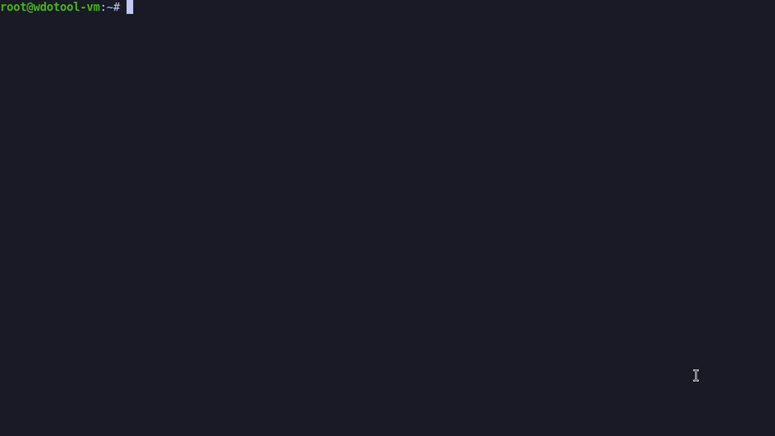
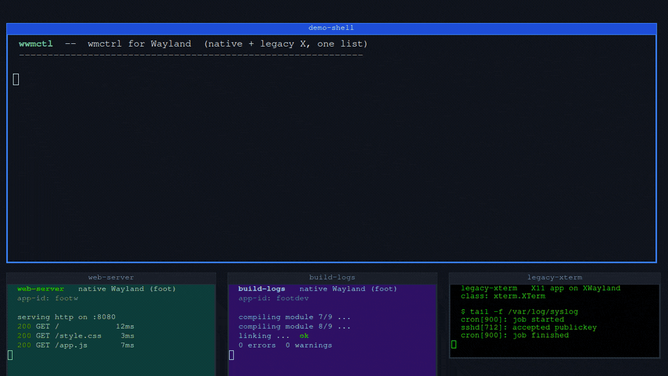
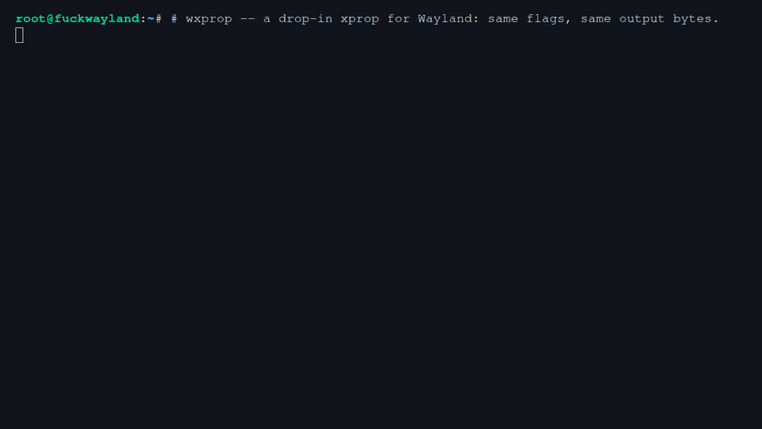

# fuckwayland

The X11 power tools — `xdotool`, `wmctrl`, `xprop`, `xrandr` — reborn as no-bullshit
drop-in clones that work on Wayland. Same commands, same flags, same output bytes,
same scripts, bugs faithfully included. Symlink them over the originals and your
muscle memory never finds out the compositor changed underneath it.


(Yes, we see the irony: these tools embrace tradition *on top of* modernity. That's
the point — the tradition was better, so it came along.)

In the box:

- **wdotool** — xdotool, all 48 commands, byte-parity
- **wwmctl** — wmctrl, for native Wayland *and* legacy X apps in one list
- **wxprop** — xprop, real X properties for XWayland windows and synthesized ones for native windows
- **wxrandr** — xrandr, with first-class multimonitor: reshape crazy layouts in one atomic call
- **warandr** — arandr, the drag-your-monitors GUI, on Wayland (via wxrandr) and X11 (via xrandr)

## wdotool

xdotool, but it works on Wayland. Drop-in: same commands, same flags, same output
bytes, same chaining, same scripts. Symlink it as `xdotool` and your scripts don't
know the difference.



*(that's wdotool driving a live sway session: typing, chaining, window search,
floating-window moves, fullscreen, mouse, close — recorded in the Ubuntu 26.04 VM
this repo tests in)*

```console
# wdotool search --class foot windowactivate --sync type 'echo hello from wayland'
# wdotool key Return
# wdotool mousemove 640 360 click 1 getmouselocation
x:640 y:360 screen:0 window:5
```

## How

There is no X server to lie to, so wdotool goes underneath instead:

- **Input** is injected as kernel-level virtual devices via `/dev/uinput` — a
  keyboard, a relative mouse, and an absolute tablet (the same shape QEMU uses, which
  every compositor maps across the whole output layout). The compositor can't tell it
  from real hardware, so this works on GNOME, KDE, sway, anything. That's also why it
  needs root — or, if you'd rather not: one udev rule (`sudo sh
  gnome/install-bridge.sh --udev` installs `gnome/60-fuckwayland-uinput.rules`,
  which tags `/dev/uinput` for the logged-in user's ACL — no group, nobody
  else) and it runs as a plain user, no relogin needed. Media keys work too
  (`key XF86AudioMute` and friends map straight to their evdev codes).
- The first invocation forks a small daemon that owns the devices (creating them
  costs ~600ms of hotplug; you pay it once) and tracks the injected pointer.
- **Window management** talks to the compositor: sway/i3 IPC (complete), GNOME
  Shell through the bundled bridge extension (complete, see [GNOME](#gnome)), KDE
  Plasma through KWin scripting (complete, and nothing to install — KWin lets any
  session-bus client load a script), and the wlr-foreign-toplevel protocol as the
  generic fallback. Window ids are real, stable, decimal — like X window ids,
  scripts pipe them around unchanged.
- Runs fine under `sudo`: the graphical session's sockets are found by scanning
  `/run/user/*`.

## Install

Three routes:

1. **[pip, from a clone](#from-a-clone-with-pip)** — the normal one: one apt
   package, one venv, one pip line.
2. **[the single-file builds](#without-installing-the-single-file-builds)** — no
   install at all, five self-contained executables.
3. **[nix](#nix)** — `nix build`, if that is your world.

Whichever you pick, your desktop wants a piece of its own — a GNOME Shell
extension on [GNOME](#gnome), the real X11 tools on an [X11](#x11) session,
nothing at all on [KDE Plasma](#kde-plasma), the GTK bindings on a minimal
[sway](#sway-and-other-wlroots-compositors) — and injecting input needs
[access to `/dev/uinput`](#input-access). Then
[check it worked](#check-it-worked).

### From a clone, with pip

```sh
sudo apt install git python3-venv
git clone https://github.com/antoniobianchi333/fuckwayland.git
cd fuckwayland
python3 -m venv --system-site-packages ~/.venvs/fuckwayland
~/.venvs/fuckwayland/bin/pip install -e .
```

That is the whole install: `wdotool`, `wwmctl`, `wxprop`, `wxrandr` and
`warandr` in `~/.venvs/fuckwayland/bin`. Put them on `PATH`:

```sh
for t in wdotool wwmctl wxprop wxrandr warandr; do
    sudo ln -sfn ~/.venvs/fuckwayland/bin/$t /usr/local/bin/$t
done
```

Four things in those lines are not obvious:

* **Why a virtual environment.** Ubuntu 24.04 and newer mark the system Python
  as externally managed, so a plain `pip install -e .` — with or without
  `--user` — refuses with `error: externally-managed-environment` and points at
  a venv, at pipx, or at `--break-system-packages`. Those are the honest
  options; [all of them work](#other-ways-to-install), and a venv is the one
  that changes nothing outside its own directory.
* **Why `python3-venv` and not `python3-pip`.** A stock Ubuntu desktop has
  neither pip nor venv nor pipx, so `pip install` is `pip: not found` before
  PEP 668 gets a word in. `python3-venv` is all you need — the venv brings its
  own pip along. (Run bare, `python3 -m venv` names the *versioned* package in
  its error, `python3.12-venv` on 24.04 and `python3.14-venv` on 26.04;
  `python3-venv` pulls the right one on both.)
* **Why `--system-site-packages`.** `warandr` is the one tool with a
  dependency: the Python GTK 3 bindings, which are the apt packages
  `python3-gi` and `gir1.2-gtk-3.0` rather than something pip should build.
  Every GNOME, KDE and Xfce install already has them — but a venv hides system
  packages unless it is told not to, and then `warandr` exits 1 with
  `warandr: GTK 3 for Python is not available (No module named 'gi') - on
  Ubuntu/Debian: sudo apt install python3-gi gir1.2-gtk-3.0`. The other four
  tools are stdlib-only and never notice. The same line, with
  `(Namespace Gtk not available)` in the parentheses, is what a machine that
  has `python3-gi` but not the GTK 3 typelib says — see
  [sway](#sway-and-other-wlroots-compositors).
* **Why `-e`, and keep the clone.** pip installs the five commands and nothing
  else — not `gnome/install-bridge.sh`, not the udev rule, not
  `warandr.desktop`. Those are used from the clone, so keep it where it is and
  let the editable install point at it.

`pip install -e .` fetches setuptools, so it wants network. On a desktop image,
which ships `python3-setuptools`, a `--system-site-packages` venv can use that
copy instead: `~/.venvs/fuckwayland/bin/pip install --no-build-isolation -e .`

Optional, for the GUI: an application-menu entry for `warandr`. Its `Exec=` is
the bare name, so this wants `warandr` on the session's `PATH` — which the
`/usr/local/bin` symlink above gives it.

```sh
mkdir -p ~/.local/share/applications
cp warandr.desktop ~/.local/share/applications/
```

To undo all of it:

```sh
sudo rm -f /usr/local/bin/wdotool /usr/local/bin/wwmctl /usr/local/bin/wxprop \
           /usr/local/bin/wxrandr /usr/local/bin/warandr
rm -rf ~/.venvs/fuckwayland ~/.local/share/applications/warandr.desktop
```

### Other ways to install

All of these were run on a stock desktop and all of them work; pick by what
you want, not by what is possible.

* **pipx** — `sudo apt install pipx`, then `pipx install
  --system-site-packages -e .` and `pipx ensurepath` once. Prefer it if pipx is
  already how you keep your tools. `--system-site-packages` is not optional
  here either: without it `warandr` fails exactly as above. Lands in
  `~/.local/bin`; undo with `pipx uninstall fuckwayland`.
* **The user site, overriding the rule** — `sudo apt install python3-pip`, then
  `pip install --user --break-system-packages -e .`. Prefer it when you want no
  venv at all and you accept the risk that flag names. Also `~/.local/bin`,
  which pip warns is not on `PATH`: a *login* shell adds it from `~/.profile`,
  but only if the directory existed at login, so log out and back in once.
  Undo with `pip uninstall --break-system-packages fuckwayland`.
* **One venv for the whole machine** — `sudo python3 -m venv
  --system-site-packages /opt/fuckwayland`, then `sudo /opt/fuckwayland/bin/pip
  install /path/to/the/clone`, and symlink out of `/opt/fuckwayland/bin`.
  Prefer it when other accounts (or `sudo` as another user) must run the tools:
  Ubuntu home directories are `0750`, so a venv under your `$HOME` is
  unreadable to them. Note the missing `-e`: an editable install keeps reading
  the source tree at run time and hits the same wall, from a readable copy it
  does not.
* **No install at all** — [the single-file
  builds](#without-installing-the-single-file-builds), below.

### X11

**What to install:** the real tools, if they are not already there —
`sudo apt install xdotool wmctrl`. (`xprop` and `xrandr` come with every X11
desktop, in `x11-utils` and `x11-xserver-utils`.) Nothing else: no extension,
no udev rule, no `/dev/uinput`. Without them you get exit **127** and a line
naming the package to install.

The tools are meant to be installed **over** the originals, so they also have
to behave when the session is a plain X11 one (Xfce, i3, GNOME-on-Xorg,
KDE-on-Xorg): there they detect the session and hand over to the real
`xdotool`/`wmctrl`/`xprop`/`xrandr` with `execve`, argv untouched — same exit
status, same signals, same stdio, no extra process. One script then runs on
both session types, and `xdotool --version` on X11 answers with the version
that is actually installed there.

```console
$ FUCKWAYLAND_PASSTHROUGH=never xdotool key a   # our own code, whatever the session
$ FUCKWAYLAND_PASSTHROUGH=always ...            # hand over, whatever the session
$ WDOTOOL_REAL_XDOTOOL=/opt/bin/xdotool ...     # where the original is
```

`WDOTOOL_PASSTHROUGH`, `WWMCTL_PASSTHROUGH`, `WXPROP_PASSTHROUGH` and
`WXRANDR_PASSTHROUGH` do the same per tool (`warandr` ignores all of them: it
never hands over, it only picks between the `xrandr` and `wxrandr` command
words, and it keeps doing that by session — it does take the `DISPLAY`/
`XAUTHORITY` repair below for the `xrandr` it runs); the `*_REAL_*` variables are
`WDOTOOL_REAL_XDOTOOL`, `WWMCTL_REAL_WMCTRL`, `WXPROP_REAL_XPROP`,
`WXRANDR_REAL_XRANDR`. With no original installed you get exit **127** and a
line saying which package to install — except for `--help`/`--version`, which
still answer, and `wxprop`, which has an X11 client of its own and simply
keeps working. Detection is Wayland-first: `$DISPLAY` is set on a Wayland
session too (Xwayland), so only a live compositor socket — or `loginctl`'s
own record of your session — counts.

Bonus, on X11 as on Wayland: run under `sudo`, over `ssh root@box` or from
cron and we find the session's `DISPLAY` and `XAUTHORITY` and hand them to
the original, so `sudo xdotool key a` works *through* us where
`sudo /usr/bin/xdotool key a` says `Can't open display`. `warandr` gets the
same repair for the `xrandr` it runs, so `--command` and `--save` answer from
a root shell too — but a *saved* layout script calls the bare command word,
exactly as arandr's does, so running the script itself still wants a session
(on Wayland that word is `wxrandr`, which finds one for itself).

### GNOME

Stock GNOME Wayland sessions — Ubuntu 24.04 (GNOME 46) and 26.04 (GNOME 50) as
installed — are supported, with one extra step: GNOME has no window-management
protocol, so the window side needs a small GNOME Shell extension that exports
Mutter over the session bus. Input injection needs nothing extra beyond
[`/dev/uinput` access](#input-access).

Run the installer from the clone — pip does not install it — and expect one
session restart: the first install exits 1 asking you to log out and back in,
because gnome-shell only scans extension directories at login. `wxrandr` and
`warandr` never need it (monitors go through Mutter's own DisplayConfig), so
until you have logged back in those two work and the window commands say
`gnome backend: the fuckwayland bridge extension is not running in GNOME
Shell; run gnome/install-bridge.sh and restart the session (log out and back
in)`.

```sh
sh gnome/install-bridge.sh          # copies the extension, enables it; log out/in once
sh gnome/install-bridge.sh --check  # is it loaded? is org.fuckwayland.Bridge owned?
sudo sh gnome/install-bridge.sh --udev   # optional: /dev/uinput for the logged-in user, no relogin
```

* **The extension** (`gnome/fuckwayland-bridge@fuckwayland`, ~1100 lines of
  JavaScript, see `gnome/README.md`) is installed per user by default
  (`--system` for `/usr/share/gnome-shell/extensions`). gnome-shell only scans
  extension directories at login, so the first install needs a logout/login
  (or `--try-unsafe`, which drives Looking Glass through `wdotool` to load it
  in place); after that the installer can enable and disable it live. Everything
  `wdotool`/`wwmctl`/`wxprop` do on GNOME goes through it: `search`,
  `windowactivate`, `windowmove`, `windowstate`, desktops/workspaces,
  `selectwindow`, `getmouselocation`'s window, X ids of XWayland windows.
* **The udev rule** (`gnome/60-fuckwayland-uinput.rules` + a `modules-load.d`
  file) tags `/dev/uinput` `uaccess`, so systemd-logind hands the user of the
  active seat an ACL on it — applied immediately by the installer, and again at
  every login. Nothing else: the node stays `root:root 0600`, no `input`-group
  route (`--udev --uninstall` restores exactly that). Without it, run the tools
  as root (`sudo`), which also works: the session is found by scanning
  `/run/user/*`.
* **Hotkeys**: bind scripts to anything but `Ctrl+Alt+F1`…`F12` — Mutter owns
  those as VT switches on Wayland, so gsd cannot grab them and injecting them
  switches the console. `<Ctrl><Super>F7` works.
* **Security note.** Any process on your session bus can then list, move,
  close and kill your windows through the bridge, and the user at the active
  seat can type as you through `/dev/uinput`. That is exactly what every X11
  client could always do, and it is the point of these tools; but it is a
  deliberate widening of GNOME's default. The bridge never evaluates code and
  never injects input; Flatpak/Snap apps without session-bus access cannot
  reach it. Do not install either piece on a machine where that trade is
  wrong — see [Threat model](#threat-model) for the full list.

### KDE Plasma

Stock Plasma Wayland sessions — Plasma 5.27 (Ubuntu 24.04) and Plasma 6.6
(26.04) — are supported with **nothing to install**: `org.kde.kwin.Scripting.
loadScript()` is plain `Q_SCRIPTABLE` with no polkit action and no bus policy
on both, so `wdotool` pushes one small JavaScript file into KWin per command
and unloads it again. `wwmctl`, `wxprop` and `wxrandr` come along with it.
(That is also a security note in the GNOME sense: any client on your session
bus can already do this, with or without these tools.)

What differs from X, and why:

| | |
|---|---|
| `windowraise` on 5.27 | KWin 5.27 has no per-window raise; the window is activated instead (which focuses it), and says so on stderr. Plasma 6 raises properly |
| `windowlower` | neither release has a per-window lower: the active window is lowered for real, any other is marked keep-below, with a warning |
| `windowstate SHADED` | works on 5.27; Plasma 6 removed window shading, so it is a clean "not supported" there |
| `windowstate MAXIMIZED_*` on 5.27 | KWin 5.27 exposes no `maximizeMode` to scripts, so a window is read as maximized when its frame is exactly the maximize area. A window you sized to fill the work area yourself therefore reads as maximized |
| `set_num_desktops` | KWin caps virtual desktops (20 on 5.27, 25 on 6) and keeps at least one; asking for more fails with that as the reason instead of hanging |
| window ids | KWin's only window handle is a UUID, so the printed ids are minted from it (`0x4…`, out of the range Xwayland gives its clients). They are stable while the window lives, and an X id is not accepted in their place |
| `wwmctl -l -G` positions | `wmctrl` doubles the frame offset under a non-reparenting WM; ours are the real ones (same on GNOME and sway) |
| XWayland ids on Plasma 6 | `x11window.h` lost every scriptable property in 6, so `View.xid` is matched through the X server's own client list (pid + `WM_CLASS`, then title and geometry). A client that publishes neither `_NET_WM_PID` nor `WM_CLASS` keeps id 0 rather than being guessed at |
| `wxprop -root` | `_NET_CLIENT_LIST`, `_NET_ACTIVE_WINDOW` and `_NET_DESKTOP_NAMES` are ours (native windows included), not KWin's stale X copies |
| `getmouselocation` | KWin's scripting API has no pointer query, so the answer is the position wdotool itself last moved to (GNOME's bridge does answer). Move the mouse by hand and the reading goes stale until the next `mousemove` |

A window state that a client applies asynchronously (fullscreen and maximize
on a Wayland client, applied when it acks the configure) is waited for before
the command returns, so `windowstate` never reports a state it merely has not
seen land yet, and the next command sees a settled window.

### sway and other wlroots compositors

Stock sway (1.11 on Ubuntu 26.04) is supported with **nothing to install** for
the four command-line tools: they speak sway's own IPC, and `wxrandr
--print-backend` answers `sway`. Input needs
[`/dev/uinput`](#input-access), exactly as on any other Wayland session.

The GUI is the exception, and it is the one place a sway install differs from
a GNOME/KDE/Xfce one: a minimal sway install has `python3-gi` but **not** the GTK 3
typelib, so `warandr` exits 1 with

```
warandr: GTK 3 for Python is not available (Namespace Gtk not available) - on Ubuntu/Debian: sudo apt install python3-gi gir1.2-gtk-3.0
```

`sudo apt install python3-gi gir1.2-gtk-3.0` is the whole fix — the four
command-line tools never notice either way, and with a
`--system-site-packages` venv the GUI picks the bindings up with no further
step. Two smaller differences, both cosmetic: a minimal image has no `acl`
package either, so `install-bridge.sh --udev --check` says
`uinput ACL users: yes, not listed here (apt install acl)` where a desktop
with `getfacl` lists the user by name (the answer on the line below it,
`uinput usable by <you>`, is the same either way); and `windowmove` on a
*tiled* window warns and does not move it — float it first
(`swaymsg floating enable`). See the [support matrix](#desktop-support) for
the rest.

### Input access

Injecting input goes through the kernel's `/dev/uinput`, which is
`root:root 0600` on a stock Ubuntu — so `wdotool`'s **input** commands (`key`,
`type`, `click`, `mousemove`, `mousedown`/`mouseup`, `behave`, and any chain
containing one) need either root or the rule below. Without it they stop with

```
cannot create uinput devices: [Errno 13] Permission denied: '/dev/uinput'
(wdotool injects input via /dev/uinput; run it as root)
```

Everything else needs nothing: the window commands (`search`,
`windowactivate`, `windowmove`, `windowstate`, `getactivewindow`,
`selectwindow`, the desktop ones), all of `wwmctl`, `wxprop`, `wxrandr` and
`warandr` reach the compositor over your own session bus and run as you.

Two ways to get it, then:

* **Run as root.** `sudo wdotool key a` works with no rule installed at all —
  the session's sockets are found by scanning `/run/user/*`.
* **Install the udev rule this repo ships**, once, from the clone:

  ```sh
  sudo sh gnome/install-bridge.sh --udev            # install it
  sudo sh gnome/install-bridge.sh --udev --check    # what is the node now?
  sudo sh gnome/install-bridge.sh --udev --uninstall # put it back
  ```

  It tags the node `uaccess`, so systemd-logind gives the user of the *active
  seat* an ACL on it: applied immediately (no relogin needed) and again at
  every login. The node itself stays `root:root 0600` — no `input` group is
  involved — and `--uninstall` restores exactly that. Despite living under
  `gnome/`, none of this is GNOME's business: the same command installs the
  same rule on a Plasma session, and the tools there use it the same way.

  Read the security note at the end of the [GNOME](#gnome) section first:
  anyone who can open `/dev/uinput` can type as you.

One gotcha while you are experimenting: `wdotool` keeps the virtual devices
alive in a small `__daemon` process, and one started while access existed keeps
injecting after the rule is removed. Log out, or kill it, to see the change.

### Installing over the originals

These are drop-in clones, so the last step is usually to put them where your
scripts already look. `/usr/local/bin` comes before `/usr/bin` on Ubuntu's
default `PATH`, so symlinking there wins without touching a single file the
package manager owns — and the originals stay exactly where they are, which is
what makes the [X11](#x11) handover work at all.

From a venv install:

```sh
sudo ln -sfn ~/.venvs/fuckwayland/bin/wdotool /usr/local/bin/xdotool
sudo ln -sfn ~/.venvs/fuckwayland/bin/wwmctl  /usr/local/bin/wmctrl
sudo ln -sfn ~/.venvs/fuckwayland/bin/wxprop  /usr/local/bin/xprop
sudo ln -sfn ~/.venvs/fuckwayland/bin/wxrandr /usr/local/bin/xrandr
```

From pipx or a `--user` install the source is `~/.local/bin/wdotool` instead;
from a single-file build, copy rather than link:
`sudo install -m 755 dist/wdotool /usr/local/bin/xdotool`. A clone that finds
itself under an original's name recognises itself and skips to the real binary,
so none of these loop.

Undo is `sudo rm` of the four names — nothing else was touched:

```sh
sudo rm -f /usr/local/bin/xdotool /usr/local/bin/wmctrl \
           /usr/local/bin/xprop /usr/local/bin/xrandr
```

Two cautions. A venv under `$HOME` is only readable by you and root (Ubuntu
homes are `0750`), so symlinks into `/usr/local/bin` that point into it break
for *other* users, and the message they get does not say why: `sudo` reports
`unable to execute /usr/local/bin/wdotool: Permission denied` on 24.04 and
`sudo: '/usr/local/bin/wdotool': command not found` on 26.04. For a
machine-wide drop-in use the [`/opt` venv](#other-ways-to-install). And a
symlink left behind after the venv is deleted just says `No such file or
directory` — remove the links when you remove the install.

### Without installing: the single-file builds

```sh
sh scripts/build-pyz.sh
```

builds `dist/wdotool`, `dist/wwmctl`, `dist/wxprop`, `dist/wxrandr` and
`dist/warandr`: five self-contained executables, 0.5–0.9 MB each, needing
nothing but the `python3` that is already on the machine — no pip, no venv, no
apt, not even a package to add. (`warandr` still imports the system GTK
bindings at run time, so the GUI wants `python3-gi` and `gir1.2-gtk-3.0` like
everywhere else; the other four are stdlib-only.)

Prefer this when you would rather not touch apt at all, when you want no venv,
when you are on a machine you do not administer, or when you want one file to
copy to another box. They run from `dist/`, from `~/bin`, or from
`/usr/local/bin` under an original's name — see
[above](#installing-over-the-originals). What you give up is `pip uninstall`
and any notion of an upgrade: you rebuild and copy again.

### Nix

`nix build` → `result/bin/` with all five tools, plus `xdotool`, `wmctrl`,
`xprop`, `xrandr` and `arandr` symlinks next to them. The flake wraps the GTK
typelibs into `warandr`, so the GUI works without a system PyGObject.

### Check it worked

The five answer everywhere, whatever install path you took (from a single-file
build, prefix them with `dist/`). Note that `wxprop` takes xprop's single-dash
`-version`:

```console
$ wdotool --version
xdotool version 4.20260303.1
$ wwmctl --version
1.07
$ wxprop -version
xprop 1.2.8
$ wxrandr --version
xrandr program version       1.5.4
Server reports RandR version 1.6
$ warandr --version
warandr 0.1.0
```

On a **Wayland** session (GNOME, KDE, sway) the version strings are ours, and
the next three commands are the real check — which backend was picked, whether
the compositor answers, and whether input lands:

```console
$ wxrandr --print-backend --verbose
mutter
session: wayland
chosen by: detection
compositor: Mutter
protocol: org.gnome.Mutter.DisplayConfig (D-Bus)
$ wwmctl -l
0x8d58a7dd  0 box Screen Layout Editor
$ wdotool key a          # types an 'a' into the focused window
```

The backend token is `mutter` on GNOME, `kwin` on Plasma and `sway` on
wlroots; the second line of `wxrandr --version` is whatever RandR version your
own session reports. `wwmctl -l` on GNOME is the one that needs the
[bridge extension](#gnome) — if it says so instead of listing windows, that is
the step still missing, and `wxrandr` above will have worked anyway.

On an **X11** session that block is not what you get, and that is the handover
working: `wdotool`, `wwmctl`, `wxprop` and `wxrandr` *are* the originals there,
so they print the versions installed on your machine rather than ours. On a
stock Ubuntu 26.04 Xfce, for instance, `wdotool --version` says `xdotool
version 3.20160805.1`, `wxprop -version` says `xprop 1.2.7` and `wxrandr
--version` says `1.5.3`, where ours — the same commands on the same box under
Wayland — say `4.20260303.1`, `1.2.8` and `1.5.4`. (`wwmctl --version` says
`1.07` either way: that is the wmctrl release we clone.) `warandr` is the
fifth and never hands over; it drives the real `xrandr`, and
`warandr --print-backend` says `x11`. If instead you get exit 127 and a line
about no real xdotool on `PATH`, install them:
`sudo apt install xdotool wmctrl`.

If something did not work, the first thing to try:

| what you saw | what to do |
|---|---|
| `wdotool: command not found` | `command -v wdotool` — the symlinks, or `~/.local/bin` not on `PATH` yet (log out and back in) |
| `gnome backend: the fuckwayland bridge extension is not running in GNOME Shell` | `sh gnome/install-bridge.sh`, then log out and back in; `sh gnome/install-bridge.sh --check` must say `loaded in shell: yes` and `org.fuckwayland.Bridge owned: yes` |
| `cannot create uinput devices: [Errno 13] Permission denied` | `sudo wdotool …`, or install the [udev rule](#input-access); `sudo sh gnome/install-bridge.sh --udev --check` should end `uinput usable by <your user>: yes (logind ACL)` |
| `warandr: GTK 3 for Python is not available` | `sudo apt install python3-gi gir1.2-gtk-3.0` — and the venv must have been made `--system-site-packages` |
| `xdotool: … no real xdotool was found on PATH`, exit 127 | you are on X11: `sudo apt install xdotool wmctrl` |
| the tool does something you did not expect on X11 | it *is* the original there; `FUCKWAYLAND_PASSTHROUGH=never` runs our own code instead |

## Desktop support

What each tool does on each desktop, measured rather than assumed: the branch is run
on seven golden VM images — GNOME 46 and 50, Plasma 5.27 and 6.6, Xfce 4.18 and 4.20,
sway 1.11 on wlroots — twice per image, once **inside the session** and once as
**root over ssh with an empty environment**, against real windows on a two-head
layout. `vm/README.md` keeps the rig and the verbatim messages behind these cells.

| | GNOME 46 / 50 | Plasma 5.27 / 6.6 | Xfce 4.18 / 4.20 (X11) | sway 1.11 (wlroots) |
|---|---|---|---|---|
| **wdotool** | all 48 commands; the window ones need the [bridge extension](#gnome) | all 48, nothing to install **(a)** | hands over to the installed `xdotool` **(b)** | all 48; two differences **(c)** |
| **wwmctl** | works; the window list needs the bridge | works **(d)** | hands over to `wmctrl` | works |
| **wxprop** | works, X and native windows | works | hands over to `xprop` | works; from a root shell `-root` is synthesized **(e)** |
| **wxrandr** | works (mutter) | works (kwin) **(f)** | hands over to `xrandr` **(g)** | works (sway) |
| **warandr** | works (mutter) | works (kwin) **(f)** | works, driving the real `xrandr` **(g)** | works (sway); the stock image has no GTK 3 bindings **(h)** |

All of it works **as the desktop user and as root** — `sudo`, `ssh root@box`, cron —
because the session's compositor socket, session bus, `DISPLAY` and X cookie are
found for you. **(e)** is the one exception, and it is not one we can fix.

**(a)** With the differences in the [KDE Plasma](#kde-plasma) table above (raise,
lower, shading, maximize on 5.27, minted window ids).

**(b)** On a plain X11 session the tools *are* the originals, so the command set is
whatever is installed there. Both Ubuntu images this branch tests on carry **xdotool
3.20160805.1**, which has no `windowstate` — `xdotool: Unknown command: windowstate`,
rc 1 — while parity is claimed against xdotool 4.20260303.1, whose full command set is
what our own Wayland code implements. `getdisplaygeometry` likewise answers per screen
(`1920 1080`) where the Wayland backends report the whole layout span (`3840 1080`):
that is xdotool's own behaviour, faithfully.

**(c)** `windowmove` on a *tiled* window warns and succeeds without moving it (float
it first: `swaymsg floating enable`, and then the move and resize land exactly);
`windowstate MAXIMIZED_VERT`/`_HORZ` has no equivalent in sway and fails cleanly.

**(d)** On Plasma 6.6 plasmashell's own desktop windows carry an empty caption, so
those `wwmctl -l` rows have a blank title where 5.27 prints `Desktop @ QRect(…)`.
KWin's caption is what we print; ids, pid, class and geometry are right on both.

**(e)** sway's Xwayland runs with no authority file, so **only the session user's own
processes can open it**: the real `xprop` from a root shell gets `Authorization
required, but no authorization protocol specified` there too. Rather than fail,
`wxprop -root` answers from sway's IPC — a synthesized `_NET_CLIENT_LIST` of
compositor ids and `_NET_SUPPORTING_WM_CHECK … 0x0`. Inside the session it is
Xwayland's real root window, and every other desktop gives root the real X root.

**(f)** KWin applies a layout immediately and permanently — no temporary mode, no
confirmation dialog — and says so on stderr, together with the line that puts the
previous layout back. `--same-as` is plainly the same position, which on KWin
already shows identical pixels; it reaches for the compositor's own
`set_replication_source` only when the two outputs' logical rectangles differ and
a shared position would give a crop instead of a copy (and says which KWin
version that would need, when the running one is older).

**(g)** X11 answers are the X server's own (`Screen 0: minimum 320 x 200 … maximum
8192 x 8192`), and whether an output is marked `primary` is the desktop's business.

**(h)** `warandr` is the one tool with a dependency (`python3-gi`, `gir1.2-gtk-3.0`).
GNOME, KDE and Xfce installs have them; a minimal sway image may not, and warandr then
names the package and exits 1. The other four are stdlib-only.

## Compatibility

All 48 xdotool commands are implemented, with output byte-compatible against
xdotool 4.20260303.1 (including `--help` text, error strings, and several verbatim
C bugs, e.g. `windowmove`'s percent-y quirk). That is our own code, i.e. every
Wayland session; on an X11 session we hand over, so what you get there is the
command set of the `xdotool` that is installed — see **(b)** under
[Desktop support](#desktop-support).

Wayland forces a few honest approximations:

| | |
|---|---|
| `key`/`type` `--window` | activates the target first, then injects (no XSendEvent) |
| `getmouselocation` | asks the compositor where the pointer is (GNOME); falls back to the injected position where it cannot (sway, KDE, wlroots) |
| `--clearmodifiers` | clears and restores the modifiers **wdotool itself** holds (from `keydown`). One held on a physical keyboard cannot be cleared through uinput at all — the kernel drops a key-up from a device that does not hold the key — and pressing it back afterwards would leave it stuck, so it is left alone; wdotool names it if it may read `/dev/input/event*` (root), and is silent, with identical behaviour, if it may not |
| `type` non-US chars | typed through the session's active layout (see below); characters it cannot produce warn and skip |
| `search --role` | roles don't exist on Wayland; matches against empty string |
| `windowraise`/`lower` | floating windows only (tiling has no z-order) |
| `set_window`, `windowreparent`, viewport/desktop-count setters | warn and succeed (cosmetic on Wayland; scripts keep running) |
| `behave`, `behave_screen_edge`, `windowmap --sync` waits on X events | unsupported, fail cleanly |
| `selectwindow` | click-to-select on GNOME (bridge grab, needs bridge v2) and KDE (KWin's picker); Escape cancels with rc 1, as does a second picker or a shell that is already modal (the GNOME overview, a menu). sway/i3 have no picker in their IPC and still wait for the next focus change |

Desktops map to workspaces (0-based). `windowunmap`/`windowminimize` use the
scratchpad on sway.

GNOME has a longer list of honest differences (shell grabs, the lock screen,
`selectwindow`): see **Known limitations on GNOME** in
[gnome/README.md](gnome/README.md).

### Keyboard layouts

`key` and `type` inject keycodes through a virtual keyboard, and the
compositor reads those keycodes through whatever XKB layout your session has
active — so a fixed US table would type `z` for `y` on a German layout and
skip every accented character. wdotool reads the compositor's *own* keymap
instead (every Wayland client is handed it on `wl_keyboard.keymap`) and looks
the character up backwards: which key, with which modifiers, produces it here.

```console
$ wdotool type 'Grüße, ça va?'      # de, fr, es, dvorak … all fine
```

* AltGr (level three) and level five are pressed when the layout needs them —
  `@` on German is AltGr+Q, and wdotool finds out *which key* is AltGr from
  the keymap, not from a guess.
* A character that needs a **dead key** becomes two keystrokes (`é` on German
  is `´` then `e`) and the application composes them, exactly as it does when
  you type it by hand. Which two keystrokes follows the Compose table every
  toolkit ships: an accent on its own is the dead key *twice* (`´` is
  dead_acute dead_acute), and dead key + space is what that table says it is
  (`'`, not `´`).
* Characters the active layout genuinely cannot produce warn and skip, one
  line each, and the rest of the string is typed — `ñ` is not on a French
  keyboard (`fr(basic)` has no `dead_tilde` and no `ntilde`), so
  `type 'ñ'` says so and types nothing.
* **When the active layout is plain US, none of this runs.** wdotool checks
  the keymap key by key against its built-in US table and, when they agree,
  uses the built-in table — the most common setup keeps the code path it
  always had, byte for byte. Keyboard *options* do not spoil that: swapping
  Caps and Escape, or putting the layout switcher on Super+Space, still
  bypasses, because what is compared is the keys the fixed table actually
  presses. The same fixed table is the fallback whenever the keymap cannot be
  read at all (no compositor, a locked screen, an unparsable keymap): a
  warning on every command that types through it, never a failure.

Two things are still on the honest list:

* **Compose-only characters.** A character the layout reaches only through a
  Compose *sequence* that is not a dead-key pair (`ø` on German, say) is
  skipped with the warning above. wdotool composes nothing itself — it
  presses keys, and the application does the composing.
* **Which of several configured layouts is active.** `wl_keyboard.modifiers`
  carries that and every compositor sends it only to the window with keyboard
  focus, which an injector never is. With one layout configured there is
  nothing to guess. With several, wdotool uses the **first** one and says so
  — including when the first one is `us`, where it is the built-in table that
  gets used. So a `us, de` session that has switched to German types US
  characters until you pin the group:

```console
$ WDOTOOL_XKB_GROUP=2 wdotool type 'Grüße'   # the second configured layout
```

### Forcing the layout

`--layout` says which character table the typing commands use, ahead of
everything else. It goes before the command, and it is ours, not xdotool's:

```console
$ wdotool --layout us type 'hello'    # the built-in US table, no questions asked
$ wdotool --layout xkb type 'Grüße'   # the compositor's keymap, even on US
$ wdotool --layout auto type 'hello'  # the default: decide per session
```

`--layout us` is the one that promises something. It does not read the
compositor's keymap and it does not run the "is this plain US?" check either,
so **no layout code executes at all** — nothing in the keymap reader or the
reverse map can affect that run. Use it when you know your keyboard is US and
you would rather the tool did not look, or to rule the layout machinery out
while diagnosing something else. `--layout fixed` is a synonym.

The option beats the variables below, which matters because those are read by
the daemon and a daemon may already be running with different ones.

| variable | effect |
|---|---|
| `WDOTOOL_LAYOUT=auto` | the default: the compositor's keymap, unless it is plain US |
| `WDOTOOL_LAYOUT=us` | never read the keymap; use the built-in US table |
| `WDOTOOL_LAYOUT=xkb` | use the compositor's keymap even if it looks like US |
| `WDOTOOL_XKB_GROUP=<n>` | pin the active layout group (1 = the first one) |
| `WDOTOOL_XKB_KEYMAP=<file>` | read the keymap from a file instead of the compositor |

These four are read by the *daemon*, which keeps the environment it was
started with, so set them before the first wdotool command of a session — or
stop the running daemon first (`pkill -f 'wdotool __daemon'`), which is what
a script that changes the pin mid-run has to do. Changing your **layout**
needs none of that: the keymap and the active group are re-read on every
single command, so a long-running daemon follows a layout switch by itself.

`wdotool __keymap` is a hidden diagnostic that prints what the compositor
actually sent; `--info` summarises it (groups, active group, whether the US
bypass takes it), and `--chars STRING` shows the keystrokes each character
would need — from the built-in table when the bypass applies, since that is
what wdotool will send.

sway and KWin implement `zwp_virtual_keyboard_v1`, which would let wdotool
upload a keymap of its own and skip the reverse lookup entirely on those two.
That is a separate change and deliberately not part of this one: it needs a
second injection path beside uinput, and it does nothing for GNOME.

### Session readiness and exit codes

`wdotool` separates "there is no session to talk to" from "the session is
fine and nothing matched", so a cron job or a boot script can poll for a
desktop without guessing:

| rc | meaning |
|---|---|
| 0 | the command did what it says |
| 1 | the session is up and the command failed — no matching window, no active window, a wait that timed out |
| 2 | **no Wayland session found**: no compositor, no session bus, GNOME Shell absent, the screen locked, the greeter, or the bridge extension not running |

```sh
# wait for a usable desktop, then act
until wdotool getdisplaygeometry >/dev/null 2>&1; do sleep 2; done
```

`getdisplaygeometry` is the cheapest probe: it needs no window and no
`/dev/uinput`. It never invents a size — with no compositor reachable it
warns and exits 2 rather than printing a made-up `1920 1080`.

### `--sync` waits are bounded

Every `--sync` wait (`windowactivate`, `windowfocus`, `windowmap`,
`windowunmap`, `windowminimize`, `windowmove`, `windowsize`) gives up after
10 seconds with `wdotool: gave up waiting for …` and rc 1. Set
`WDOTOOL_SYNC_TIMEOUT` (seconds; `0` waits for ever) to change it. The one
exception is `search --sync`, which blocks until there are results — that is
what its manpage entry promises, and it is how scripts wait for an
application they have just launched.

### Pointer accuracy

`mousemove` and `mousemove_relative` are pixel-exact: the target is emitted
as an absolute position on a virtual tablet mapped across the whole output
layout, so neither pointer acceleration nor an already-identical coordinate
can lose the move. On sway/i3, relative moves keep using relative events
(that rig runs `pointer_accel 0`); `WDOTOOL_REL_MODE=abs|rel` forces either
mode anywhere.

## wwmctl



`wmctrl`, same treatment — and it handles **both** native Wayland apps and legacy X
apps (XWayland) in one list. The compositor exposes XWayland windows with their real
X11 window ids, so wwmctl prints ids that `xprop` and your old scripts can actually
use, enriched straight from the XWayland server over a built-in X11 wire client.
Native windows ride along with compositor node ids:

```console
$ wwmctl -lGpx
0x00000005  0 31496  0    23   640  697  foot.foot             host yans@host: ~
0x0040000c  0 31526  642  23   636  695  xterm.XTerm           host yans@host: ~

$ wmctrl -lGpx        # the real one, on the same desktop
0x0040000c  0 31526  1284 46   636  695  xterm.XTerm           host yans@host: ~
```

Real wmctrl on Wayland can't see the foot window at all, prints doubled coordinates
(a non-reparenting-xwm quirk), its `-c` silently closes nothing, and `-a` only sets
an urgency hint. wwmctl routes every action through the compositor, so `-a`
focuses, `-c` closes, `-e` moves — for X and Wayland windows alike. Symlink it as
`wmctrl` (nix does this for you) and byte-parity covers the rest: help text, list
formats, error strings, exit codes. (One deliberate exception: the machine
column is sized from the longest hostname, not — as wmctrl 1.07's `main.c`
does — from the last row's, which our stacking-ordered list would re-flow on
every raise. See [WWMCTL.md](WWMCTL.md).)

On GNOME (with the bridge extension, see [GNOME](#gnome)) the same list mixes
XWayland windows under their real X ids with native windows under Mutter's ids,
`-d` prints GNOME's workspace names and work areas, `-m` says `GNOME Shell`,
`-k` and `-n` reach the shell, and every action goes through Mutter — including
`-b add,maximized_vert` as a real per-axis maximize. The X plane is reached with
Mutter's own Xwayland cookie, so it works from a custom shortcut, under `sudo`
and from `ssh root@` alike; Xwayland (which Mutter starts on demand) is never
spawned just to be listed. Details in `WWMCTL.md` § GNOME.

## wxprop



`xprop`, dual-plane. XWayland windows report their **real** X properties, byte-for-byte
identical to xprop 1.2.8 — the whole formatting machine is ported, down to the
`WM_HINTS`/`WM_SIZE_HINTS` structured dumps, the dformat mini-language, 32-bit
sign-extension quirks, and yes, the `_NET_WM_ICON` ASCII-art renderer. Native Wayland
windows get a synthesized property set in the same grammar, so `xprop -id N WM_CLASS`
script parsing works on every window:

```console
$ wxprop -id 0x0040000c WM_CLASS       # an XWayland window — real X property
WM_CLASS(STRING) = "xterm", "XTerm"

$ wxprop -id 5 WM_CLASS                # a native Wayland window — synthesized
WM_CLASS(STRING) = "foot", "foot"
```

`-set`/`-remove`/`-spy` work on the X plane; `-f`/`-fs`/dformats, `-len`, `-root`,
`-name`, click-to-select all match the real tool (including which double-dash forms it
rejects). Verified byte-identical against the real xprop on a live XWayland server.

`-font` is real too: XWayland serves the core fonts, so `wxprop -font fixed` is
byte-identical to `xprop -font fixed`.

On GNOME (see [GNOME](#gnome)) native windows get their synthesized set from the
bridge — states, window types, `WM_CLASS` from the app id — and `-spy` follows the
shell's window events; `-root` is Mutter's real X root with `_NET_CLIENT_LIST`,
`_NET_ACTIVE_WINDOW` and the desktop properties re-synthesized so they cover native
windows too. Details in `WXPROP.md` § GNOME.

Two honest limits, both inherent: a native window has no window-type hint to report
(xdg-shell has none), so a GTK dialog prints `_NET_WM_WINDOW_TYPE_NORMAL` where its
XWayland twin prints `DIALOG`; and under `-len` truncation real xprop renders
*uninitialised heap* past the end of the fetched data, which nothing can reproduce —
we stop at the budget instead. `wwmctl`'s equivalents (`:SELECT:` waits for a focus
change rather than a click; `shaded`/`modal` are no-ops on both sides) are in
`WWMCTL.md`.

## wxrandr


`xrandr`, with the crazy multimonitor configs as the whole point, not an afterthought.
A real pending-geometry resolver means relative-placement chains resolve in **one
atomic invocation**:

```console
$ wxrandr --output DP-2 --right-of DP-1 --output HDMI-A-1 --below DP-2 --rotate left
$ wxrandr --output DP-2 --scale 1.5x1.5 --output DP-1 --primary
$ wxrandr --output HDMI-A-1 --same-as DP-1        # mirror
```

Mirroring, rotation, reflection, mixed per-output scales, portrait/landscape mixes,
custom modelines (`--newmode` with real pixel-clock math), holes in a row, negative
origins, `--dryrun` — all first-class, applied through sway IPC or an atomic
wlr-output-management backend. `--brightness`/`--gamma` run over wlr gamma-control via
a detached holder process (the control dies with its client, so we simply refuse to
die). Query/`--listmonitors` output is byte-styled after xrandr 1.5.4, and the layout
stays consistent with the rest of the toolbox: after any change, `wdotool
getdisplaygeometry` and `wwmctl -d` track the new world.

It also works on a stock GNOME desktop — Ubuntu 24.04 (GNOME 46) and 26.04 (GNOME 50)
as installed, no shell extension, no root: wxrandr talks to
`org.gnome.Mutter.DisplayConfig` on the session bus through the toolbox's own
stdlib D-Bus client and submits the whole layout as one `ApplyMonitorsConfig` call.
Relative placement, rotation, mirroring (`--same-as` becomes one logical monitor),
scales snapped to what Mutter offers, `--primary`, `--off` and `--dryrun` (Mutter
verifies the configuration without applying it) all map; Mutter's own validation
errors ("Logical monitors not adjacent", "Logical monitors overlap") come back as
one-line failures in Mutter's name (`xrandr: GNOME's Mutter refused this layout:
...`) — nothing is refused here, so a "no" is always the compositor's — and since
Mutter, unlike X, allows neither gaps nor overlaps, an output
that changes size (`--rotate`, `--mode`, `--scale`, `-s`, `-o`) keeps its neighbours
touching it, with a warning. Changes are temporary like xrandr's; `--persistent`
writes `monitors.xml` (GNOME then asks "Keep changes?"). It finds the session from a
custom keyboard shortcut, under `sudo`, or from `ssh root@` with no environment.

Which backend it is using is never a guess: `--print-backend` prints the token
(`--verbose` adds the session, why it was chosen, the compositor and the
protocol version), `--backends` lists them all with their availability here and
a reason where there is none, and `--backend NAME` forces one for that
invocation — beating `$WXRANDR_BACKEND`, which beats detection. `--backend x11`
means "hand over to the real xrandr", even on Wayland; a Wayland backend runs
our own code even on X11; an unavailable one is one line saying what was
missing, never a silent fallback.

```console
$ wxrandr --print-backend --verbose
mutter
session: wayland
chosen by: detection
compositor: Mutter
protocol: org.gnome.Mutter.DisplayConfig (D-Bus)
available: yes
$ wxrandr --backends
  sway    unavailable  no sway or i3 IPC socket ($SWAYSOCK)
  kwin    unavailable  the compositor does not advertise kde_output_management_v2
* mutter  available    org.gnome.Mutter.DisplayConfig on the session bus
  wlr     unavailable  the compositor does not advertise zwlr_output_manager_v1
  x11     available    /usr/bin/xrandr
```

## warandr

`arandr` — the little GTK window where you drag your monitors around — reborn for
Wayland. Same window, same menus, same `~/.screenlayout/*.sh` scripts: warandr
loads arandr's saved layouts and arandr loads warandr's. Under Wayland it talks to
`wxrandr` (one atomic apply per click), under X11 to plain `xrandr`, and it tells
you in the status bar exactly which command Apply is about to run:

```console
$ warandr                      # the GUI: drag, snap, right-click, Apply
$ warandr --command            # what Apply would run, no GUI
wxrandr --output DP-1 --primary --mode 1920x1080 --pos 0x0 --rotate normal --output HDMI-A-1 --mode 1280x1024 --pos 1920x0 --rotate left
$ warandr --save ~/.screenlayout/desk.sh   # an arandr-compatible layout script
$ cat ~/.screenlayout/desk.sh              # bind this to a hotkey, as with arandr
#!/bin/sh
wxrandr --output DP-1 --primary --mode 1920x1080 --pos 0x0 --rotate normal --output HDMI-A-1 --mode 1280x1024 --pos 1920x0 --rotate left
```

On top of arandr's menu (Active, Primary, Resolution, Orientation) every output also
gets Refresh rate, Reflection, Mirror of, and — Wayland only — Scale (1 … 3, the
compositor's HiDPI factor). **Overlapping outputs are allowed wherever the desktop
allows them** — measured: X11, KWin and sway/wlroots all take the geometry *and*
show the same pixels in the shared region (byte-identical crops on both heads), so
a partial overlap really is a partial mirror there; GNOME's Mutter refuses any
layout that is not edge-adjacent (`Logical monitors not adjacent`) and warandr
reports that refusal in Mutter's name, not its own. Mirror of two outputs whose
sizes do not match is where that stops being enough — a shared position then
crops rather than copies — and on KDE `--same-as` switches to KWin's own
output replication for exactly those, and only those. The status bar says which of
the four you are getting at the moment of the drop, and the saved script keeps it
in its comment header; `WARANDR.md` and `WXRANDR.md` have the table, the evidence,
and why true region mirroring (a resident capture-and-paint helper, `wl-mirror` on
wlroots) is deliberately out of scope. The layout is kept anchored at 0,0, Apply
runs off the main loop and a failed Apply keeps your edits. It needs the GTK 3 bindings every stock Ubuntu
desktop already has (`python3-gi`, `gir1.2-gtk-3.0`) and nothing else — no cairo:
the canvas is plain widgets. `warandr.desktop` puts it in the Settings menu.
Contract: `WARANDR.md`.

Which backend it is talking to is in the window at all times — the status bar's
right-hand corner says `backend: mutter (Wayland)` or `backend: xrandr (X11)`,
with the full explanation in its tooltip — and **Layout ▸ Backend** changes it:
Automatic, X11 (xrandr), sway, wlroots, GNOME (mutter), KDE (kwin), the ones
this session cannot reach greyed out with the reason. Picking one re-reads the
screen through it and redraws; if it cannot be reached you get the dialog and
the previous one back, never an empty window. The same spellings work on the
command line, so a hotkey can pin one:

```console
$ warandr --print-backend            # mutter
$ warandr --print-backend --verbose  # ...and what runs, why, and what it found
$ warandr --backend x11              # the GUI, talking to the real xrandr
$ warandr --backend mutter --command
wxrandr --backend mutter --output DP-1 --primary --mode 1920x1080 --pos 0x0 --rotate normal
```

On a stock GNOME desktop (verified on Ubuntu 24.04 and 26.04, Wayland session):
`scripts/build-pyz.sh`, copy `dist/warandr` and `dist/wxrandr` to `/usr/local/bin/`
— warandr itself carries wxrandr inside, but the layout scripts it saves call bare
`wxrandr`, exactly like arandr's call bare `xrandr`, so a script bound to a hotkey
needs it on `PATH` (Save As says so in the status bar when it is missing). Bind
`warandr` and `~/.screenlayout/desk.sh` to GNOME custom shortcuts on `<Super>F`-keys
(`<Ctrl><Alt>F1`–`F12` are Mutter's VT switches); the script restores a three-head
layout in about a second. Apply is temporary, like xrandr: Mutter drops it at the
next hotplug or login, so the shortcut script *is* the way to keep a layout. A
monitor plugged in while the window is open shows up after New (Ctrl+N), as in
arandr; a layout with a gap between monitors gets Mutter's own "Logical monitors not
adjacent" in the error dialog and stays on the canvas to be fixed. One GNOME habit
to know: an Apply that turns a monitor off or on makes Mutter move the keyboard
focus off the window, so click it before the next Ctrl+S.

## Threat model

These are power tools: they exist to give a script the reach an X11 client
always had. That reach is the product, so the honest thing is to say exactly
what it is, who gets it, and what is not defended against.

**What the tools do by design.** `wdotool` injects keystrokes and pointer
events as a kernel-level virtual device, which every application — your
terminal, your password prompt, the lock screen — receives as real hardware.
`wwmctl`, `wxprop` and `wxrandr` read and change window and display state
through the compositor. Anything you can do at the keyboard, a script running
as you can do through these tools; that is the whole point, and it is not a
vulnerability.

**What installing the pieces grants, and to whom.**

* **The GNOME bridge extension** grants **every process that can reach your
  session bus** — including a sandboxed app allowed to talk to
  `org.gnome.Shell`, because the object answers there too — the ability to
  list every window with its title, class, pid, geometry and workspace (stock
  GNOME withholds that: `org.gnome.Shell.Introspect` is sender-allowlisted);
  to move, resize, restack, close and **SIGKILL** any window; to learn
  `DISPLAY` and the path of Mutter's Xwayland cookie; to take the shell's
  modal input grab for the length of one window pick; and to confirm a
  pending display-configuration change. There is no partial mode and no
  caller check. The bridge never evaluates code and never injects input.
* **The udev rule** grants `/dev/uinput` — i.e. the ability to type as you —
  to the user of the **active seat session**, through a logind ACL, and to
  nobody else: no group, no standing channel. The grant is checked at
  `open()`, so the daemon re-checks it before every injection and destroys
  its devices when the seat moves to another session; a user who switches
  away therefore stops being able to type into the session they left.
* **KDE needs nothing installed**, which is itself the note: any client of a
  Plasma session bus can already load a script into KWin, with or without us.
* **Running as root** (`sudo wdotool`) is the alternative to the udev rule.
  Then the tools find the graphical session by scanning `/run/user/*` and
  logind, and talk to that user's compositor as root.

**What is deliberately not defended against.** Anyone who can already run
code as you: they can type through the daemon, read the same files and talk
to the same buses — a same-uid boundary is not one we can enforce, and we do
not pretend to. A hostile compositor (you are already inside it). The lock
screen: injected keystrokes reach it, because the kernel does not know they
are injected — do not install the udev rule on a machine where someone else
has physical access to the keyboard while you are away. Scripts you saved and
run later (`warandr`'s layout scripts are shell scripts; read one before
running it, as with any script). And nothing here is a sandbox: the tools do
not confine what a command they hand over to (`xdotool` on X11) then does.

**What is defended against**, and stays that way: another local user. The
daemon socket, its lock and the wxrandr state file are private to their
owner and validated before they are believed; the daemon refuses to talk to a
socket somebody else is listening on; a state file that is not ours is
ignored rather than obeyed; the real-tool search never looks in the current
directory; and a root run with no session never hands a planted X server
another user's cookie.

**If you want less exposure:** don't install the bridge extension or the
udev rule — run the tools under `sudo` when you need them, which grants
nothing standing to anybody.

## Fully vibed, fully awesome

Every line of this repo was written by AI (Claude): the design contracts, the code,
the torture rigs, the hostile fake X servers, the byte-parity oracles, the VM demo,
this README, and yes, the meme. Fully vibed. Also fully awesome: 1371 tests and
counting, live-compositor integration suites, byte-for-byte output parity against
the real tools (verbatim bugs included), and every "it works" claim proven inside a
real Ubuntu 26.04 VM before it shipped. Vibe-check the code yourself — it can take it.

## Testing

Developed against a real Ubuntu 26.04 VM driving headless sway through the full
uinput path — see `vm/` for the whole rig (`mkvm.sh`, `run.sh`, `compositor.sh`) and
`tests/` for the suite: unit, live-compositor integration, hostile fake X servers,
and byte-parity oracles against the real xdotool and wmctrl binaries.
